## It's Fresh! - Introduction
----
You can view the live site here:- [It's Fresh!]( https://XXXXXXXXXXX)

**It's Fresh!** is a fictional award-wining vegetarian takeaway located in the trendy Hampstead Heath area of London providing nutritious meals and educating people about the wider impact of the food we consume on ourselves and the environment.  The takeaway website targets **health conscious individuals** who are looking for convenient and reasonably priced vegetarian meal options on a daily basis. 

This website, which resulted from applying the creation process of strategy, scope, structure, skeleton and surface and the design principles, was developed using the Django Framework.  It is my final Portfolio Project for the 2022/23 Full Stack Web App Software Development Bootcamp by Code Institute and Westminster Adult Education Services.
 
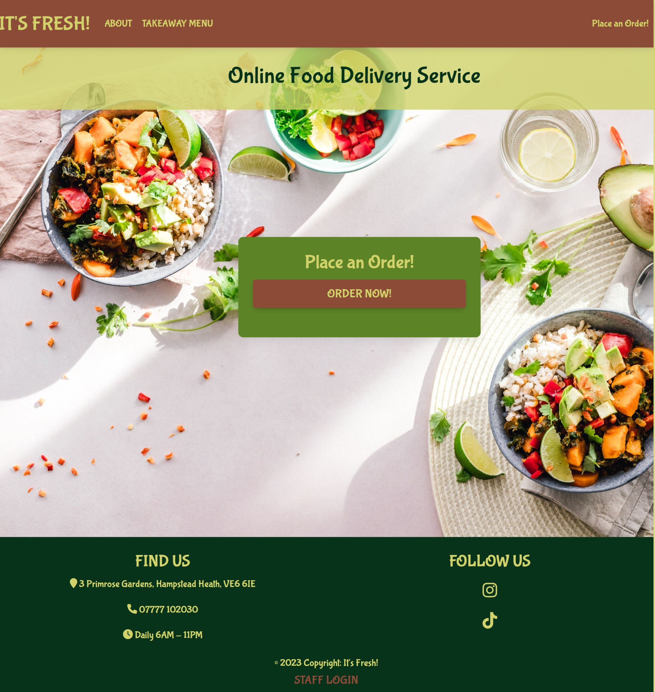

----

## [Content](#content)
- [It's Fresh! - Introduction](#its-fresh---introduction)
  - [User Experience - UX](#user-experience---ux)
    - [Site Aims](#site-aims)
    - [Agile Methodology](#agile-methodology)
      - [Epics and User Stories](#epics-and-user-stories)
      - [Tasks](#tasks)
  
  - [Strategy](#strategy)
  - [Scope](#scope)
  - [Structure](#structure)
  - [Skeleton](#skeleton)
    - [Wireframes](#wireframes)
  - [Surface](#surface)  
  - [Design](#design)
    - [Colours](#colours)
    - [Typography](#typography)
    - [Imagery](#imagery)
  - [Database Model](#database-model)
  - [FEATURES](#features)
  - [Customer](#customer)
    - [Home Page](#home-page)
      - [Navigation bar](#navbar)
      - [Place An Order Button](#order-section)
      - [Footer](#footer)
    - [About Page](#about-page)
    - [Menu Page with Search Bar](#menu-page)
  - [Staff](#staff)
    - [Sign In](#signin)
    - [Dashboard](#dashboard)
  - [Superuser](#superuser)
    - [Admin Panel](#admin-panel)
  - [Technologies Used](#technologies-used)
    - [Languages Used](#languages-used)
    - [Django Packages](#django-packages)
    - [Frameworks - Libraries - Programs Used](#frameworks---libraries---programs-used)
  - [Testing](#testing)
      - [Validation](#validation)
      - [Manual Testing](#manual-testing)
  - [Bugs](#bugs)
      - [Fixed Bugs](#fixed-bugs)
      - [Unfixed Bugs](#unfixed-bugs)
  - [Deployment](#deployment)
      - [Creating the Django project](#creating-the-django-project)
      - [Creating Heroku app](#creating-heroku-app)
      - [Set up Environment Variables](#set-up-environment-variables)
      - [Heroku deployment](#heroku-deployment)
      - [Final Deployment](#final-deployment)
  - [Credits](#credits)
    - [Content](#content)
    - [Information Sources / Resources](#information-sources--resources)
  - [Acknowledgement](#acknowledgement)

-----

# User Experience - UX

## Site Aims

* It's Fresh! is a vegetarian takeaway website for busy health and environmentally conscious professionals who are interested in eating intelligently daily.  
* The site is aesthetically pleasing, educative and informative and serves both the Customer (both new and returning) and the takeaway Staff.  It is intuitive to use and quick and easy to navigate for both sets of users.
* The Customer has the ability to order food as well as a tool to search the menu according to various attributes such as price, dish, ingredient, calories, carbon rating, etc. 
* The Customer can create and edit their food order.  
* The takeaway Staff can see the dashboard which sets orders made, whether they are paid and shipped or not and the day's running tally of orders and revenues.  The takeaway staff can sign up and sign in to access the dashboard features.  
* The takeaway Staff can access all the features of the website and can read, create, edit, and delete the menu items.

## Agile Methodology

The Agile Methodology was used to plan this project. This was implemented using Trello where the project was divided into the following sections: 

* To Do - All the user stories were initially entered in the 'To Do' board
* Doing - During the development phase, the stories were moved into the "Doing" board
* Testing - Manual testing was done next and the stories moved to the 'Testing' board
* Done - and then finally they get moved into 'Done' once the development and testing/bug resolution is completed

Please find my Kanban Board with my Customer user stories in progress as at 23 March 2023 [here](coderscafe/assets/images/SnapshotKanbanonTrello26.03.23.png)

## Epics and User Stories

The following Epics were created which were further developed into 21 User Stories, based on the User Personas below

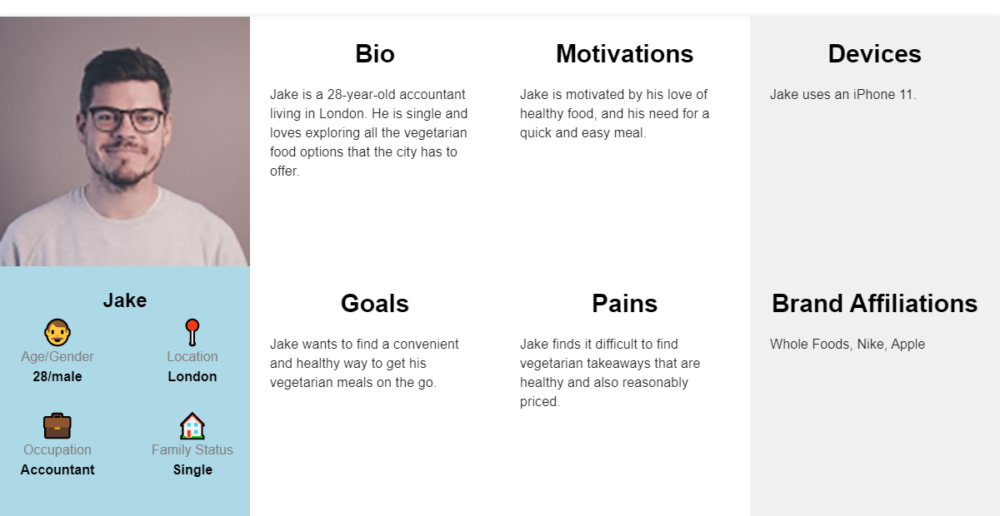
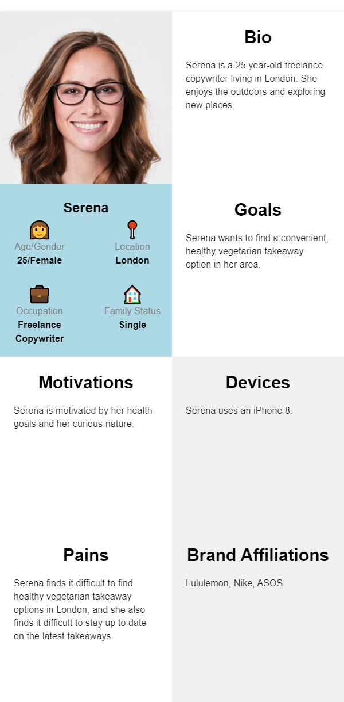
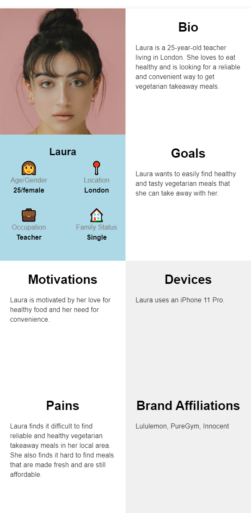

 .

### Epic 1- Website UI
Epic Goals for Customer - 
* User personas were generated using [User Persona AI](https://userpersona.dev/)
* An intuitive User Interface which is easy to navigate throughout the website 
* Easily see the purpose of the site from the landing page
* View the menu
* Search bar for menu page with quick and easy access to required information

#### Related User Stories:
- Navigation
    - View site navigation:
        - As a **Customer** I can **easily see the purpose of the site from the landing page** so that **I can see if the site is relevant to my needs.**
- Place an order
    - Create Order: 
        - As a **Customer** I can **see the list of all the menu items and their attributes** so that **I can choose what I want to order** 
    - Placing of Order: 
        - As a **Customer** I can **get a second chance** so that **I can decide whether to order as per initial selection or change it**     
    - Confirmation of Order and Making Payment: 
        - As a **Customer** I can **get a confirmation email of the order with payment options** so that **I can decide how to pay** 
    - Confirmation of Payment:
        - As a **Customer** I can **get confirmation of payment I have made** so that **I know that my order has been accepted and when it will be delivered** 
    - Cancellation of Paid Order:
        - As a **Customer** I can **cancel a paid order** so that **I can get a refund** 
    - Customer Login:
        - As a **Customer** I can **login to my account and see previous orders** so that **I do not have to repeat my personal details every time I order and I can repeat my precious orders easily** 
   
- Additional information
    - View About:
        - As a **Customer** I can **read about the ethos of the takeaway** so that **I can see if they meet my values**
    - View Menu:
        - As a **Customer** I can **view the takeaway’s menu** so that **I know what they are currently offering**
        * As a **Customer** I can **use a search bar in the Menu page to search for food items with specific attributes** so that **I can make my ordering decision.**
    - View Blog:
        - As a **Customer** I can **click on the Blog posts page** so that **I can read interesting articles about the menu items created by the takeaway, the impact of different foods on my body and the environment, etc during my leisure time.**
    - View contact information (Footer):
        - As a **Customer** I can **view contact information and the opening hours** so that **I know where the takeaway is and when it is open**
    - View social media (Footer):
        - As a **Customer/Site Admin** I can **view social media links** so that **I can open external links to the restaurant’s social media accounts**

### Epic 2 - Staff Dashboard 
Epic Goals for Staff -
* Easy Sign Up, Sign in and Sign Out
* Update / Read / Delete the Dashboard system of tracking Customer orders 
* View daiy tally of orders and revenue
* Approve for delivery any orders which have not been paid for by the Customer

#### Related User Stories:
- Dashboard system
    - Order management
        - As **Staff** I can **access daily customer orders all in one place** so I can **easily track daily revenues and orders status**
        - As **Staff** I can **login and logout easily** so I can **see the Dashboard**
        - As **Staff** I can **check the status of any order** so I can **do any necessary update or delete actions for customer orders**
        - As **Staff** I can **view the customer details** so I can **decide whether an unpaid order should be made and delivered for cash**
       
          
### Epic 3 - Website Management
Epic Goals for Site Admin / Superuser -
* Easy registration of an account
* Easy Sign Up, Sign in and Sign Out
* Easy access to Create, Read, Update and Delete (CRUD) features upon signing in
* Give certain permissions to staff
* Visibility of all Customer orders

#### Related User Stories:
- Management
    - Site management
        - As a **Superuser** I can **ensure all different parts of the website run smoothly with no bugs** so that **all users have a great experience** 
    - Menu management
        - As a **Superuse** I can **create, read, update and delete menu items** so that **I can keep the menu up-to-date** 
    - Managing Customer orders
        - As a **Superuser** I can **create, read, update and delete customer orders** so that **I can manage the entire customer order cycle** 
    - Staff authentication and authorisation
        - As a **Superuser** I can **authorise staff to perform specific functions** so that **I can keep control of staff activities** 

## Tasks
The tasks for the website development process as per the Code Institute method were closely followed.  

## Strategy 
The Strategy Table for Epic 1 is shown below which assisted in evaluating the importanceof the tasks to be done:

Task| Importance| Viability/Feasibility
------------ | -------------------------|---------
Site navigation | 5 | 5
Create Order | 5 | 4
Menu page | 5 | 5
Place Order | 5 | 5
Confirm Order | 5 | 5
Make Payment | 5 | 4
Confirm Payment | 5 | 4
Cancel a Paid Order | 4 | 1
About Page | 5 | 5
Footer with Contact and Socials | 4 | 4
Blog Page | 4 | 1
Customer Login | 2 | 1

## Scope
The strategy table indicates that not all features for Epic 1 could be immediately implemented in the initial release of the project. So the ability to cancel a paid order, provide a Customer login and set up a Blog page have been deferred to the next release. Thus, this initial release focussed on the rest of the tasks of Epics 1, 2 and 3 which incorporate the essential features necessary to create the minimum viable product.

The tasks that I have done during the development phase of the website were carried out in this order.

**Before Project Inception**

- Design ERD and Data 
- Create Repository in GitHub
- Create Project, Epics, User Stories and prepare Kanban Board

**Creation of Project in GitPod**

- Create the django project with `pip3 install 'django<4'`. Check details in [deployment-section](#deployment)
<!--->
- Deploying app to Heroku - Details in [deployment](#deployment) section 
<!-->
- Create Database Models
	- Set up models.py file in "Customer" directory

- Set up Templates in ""Customer" directory
	- Create base.html - Navbar and Footer content, which gets extended to all the other template files
	- Add responsiveness to navigation.html and footer.html
    - Create index.html (and also create static/customer with images for photos and site.css for style)
	- Set up template file features with views.py and urls.py
    - about.html (Description about It's Fresh!)
    - menu.html (to view all menu items)
    - order.html (for Customer to make order)
    - order_confirmation.html (for Customer to receive summary of their order and payment details)
    - order_pay_confirmation.html (for Customer to receive payment confirmation if they pay using Paypal)

- Set up Templates in "Cafe" directory
	- Replicate base.html from "Customer" directory 
    - Replicate navigation.html from "Customer" directory 
    - Create dashboard.html (shows tally of daily reveues and orders and the details of all unshipped orders in table format)
    - Create order-details.html (sets out customer details, payment and shipping instructions)
    - Set up template file features with views.py and urls.py

- Build Admin Site using the Django framework

- Install Allauth for sign in, sign up and sign out templates with `pip3 install django-allauth` 

- Install crispy-forms to add styles to Django account templates with `pip3 install crispy-bootstrap4` and `pip3 install crispy-forms==2.0`
- Install Pillow to allow image procesing in Python with `pip3 install Pillow==9.4.0`

- Intensive Manual Testing and Validation checks of each page and codes written (unfortunately due to lack of time no automated tests were coded in tests.py)

- Final Deployment steps

## Structure

The structure of the website was limited to 3 pages, populated with essential information.  However, the interactive nature of the website - with apps for Customer and Staff respectively - was facilitated by individual smaller html pages.  

## Skeleton

**Wireframes**

The wireframes which provided the skeleton for this project were generated using [LucidChart](https://lucid.app/documents#/templates?folder_id=home). 
- [Wireframe for Home Page](coderscafe/assets/images/Home_page_wireframe.jpeg)
- [Wireframe for About Page](coderscafe/assets/images/About_page_wireframe.jpeg)
- [Wireframes for Menu Page](coderscafe/assets/images/Menu_page_wireframe.jpeg)

## Surface

A design was created that allowed a seamless flow through the website with the use of consistent colours, typography and carefully selected appealing images.

[Back to top ⇧](#content)

-----

## Design

### Colours

The underlying theme of the takeaway is to serve wholesome vegetarian food and thus the colour palette from [Scheme Colour](https://www.schemecolor.com/) chosen comprised of greens and brown.  The colour scheme was consistently maintained throughout the website as background and text colours with contrasting colours used to enhance visual clarity.  

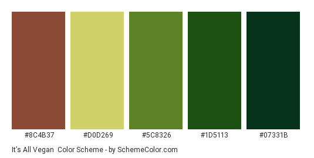

### Typography

Following a Google search of the top 10 restaurant fonts, the Bubblgum font (ranking as number 4) was imported using Google Fonts. It is described as "an upbeat, flavor-loaded, brushalicious letters for the sunny side of the street. It bounces with joy and tells a great story" and so perfectly married with the purpose of It's Fresh!.  Bubblegum was used throughout the website with a backup of sans-serif. 

It is easily legible for users.

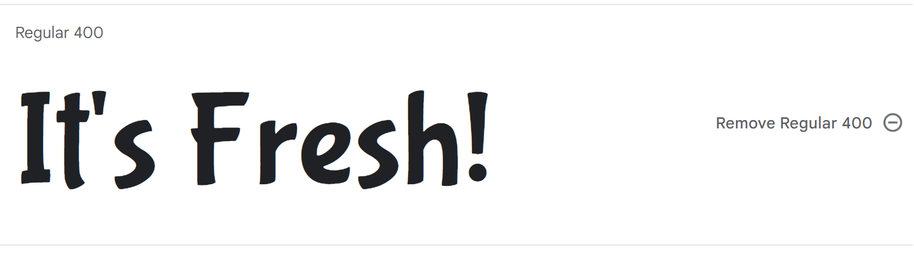

### Imagery

Except for the menu items which are all photos taken by me, the remainining imagery has been sourced from royalty free photo sites.  A limited number of simple evocative photos were chosen for the site.  FontAwesome icons have also been used.

----

## Database Model

This project was built with the Django Framework. Django is a Python based framework designed to create web applications, and it encourages rapid development. Django is based on Model-View-Template (MVT) [architecture](coderscafe/assets/images/Django_MVT.png). MVT is a software design pattern for developing a web application. It consists of the following three entities:

- The **Model** manages the data and is represented by a database. A model is basically a database table.
- The **View** receives HTTP requests and sends HTTP responses. A view interacts with a model and template to complete a response.
- The **Template** is basically the front-end layer and the dynamic HTML component of a Django application.

## ERD  

[ERDPlus](https://erdplus.com/standalone) was used during the planning stage to create a database schema to visualise the types of custom models the project requires. Creating a schema in the form of such a visual diagram helped me gain a clearer understanding of what needed to be added to each model.  The relationship between the Entities Category, MenuItem, Order and Customer are shown in the diagram below.  Unfortunately due to time constraints the Customer Entity was not pursued and the attributes attached to it were transferred to Order. Below is the Database structure that this project is based on. 

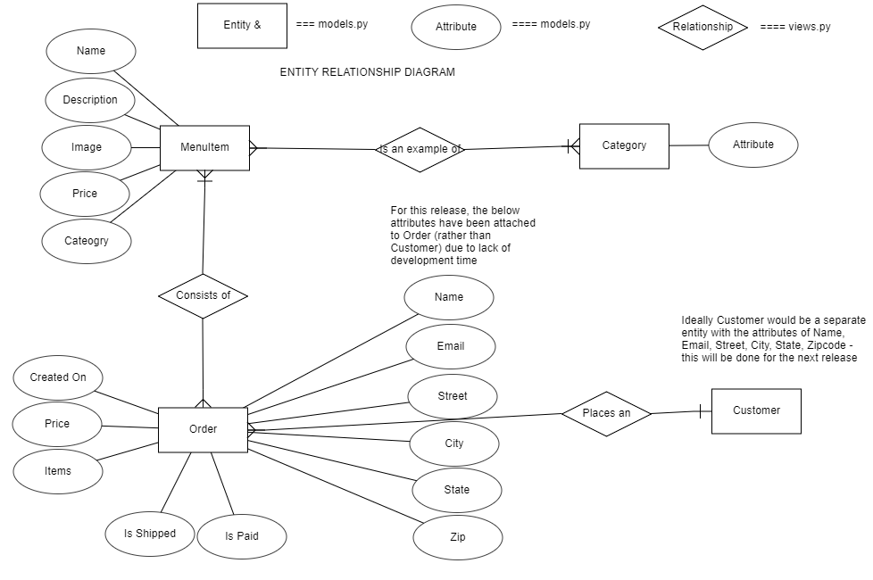

[Back to top ⇧](#content)

----

# FEATURES

# Customer 

## Home Page

- The site opens to show the text 'Online Food Delivery Service' against a full size background hero image of bowls of food and glass with drink.  
- There is a clickable centrally positioned 'Place an Order' button in the centre of the hero image.  
- The navigation bar from the left shows the logo (which is simply the name of the takeaway), About page link and Takeaway Menu page links and on the far right another call to action clickable button named 'Place an Order'.  
- The footer shows the contact information and social icons together with bottom centrally placed 'Staff Login' clickable button below the copyright.  
- The Home Page is responsive.  On smaller screens, the central 'Place an Order' button spans the width of the screen, the navigation bar turns into a hamburger and the footer vertically aligns the information.   

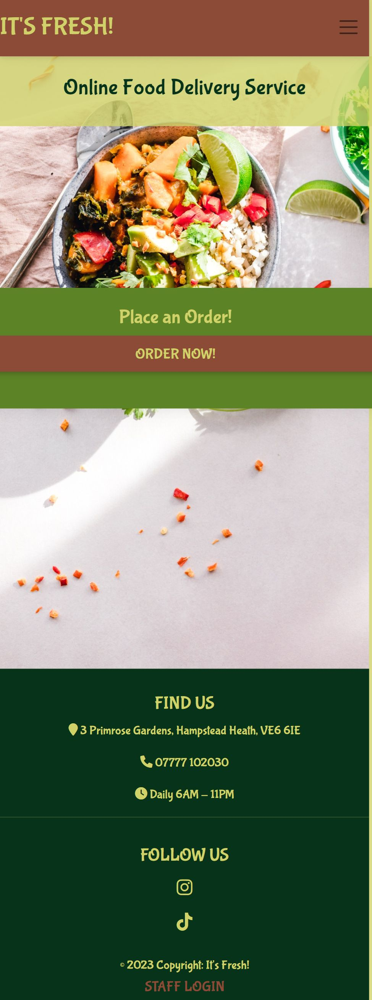

----

## Navigation Bar 

- The navigation bar is present at the top of every page and navigates all links to the respective pages.
- The navigation bar from the left shows the logo (which is simply the name of the takeaway), About page link and Takeaway Menu page links and on the far right another call to action clickable button named 'Place an Order'.
- The navigation bar is fully responsive, collapsing into a hamburger menu when the screen size becomes smaller.

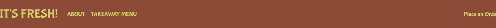

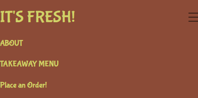

----

## Place an Order Button

* When the Order Now button on the Place an Order card is clicked on the Home Page or navbar, the order form is displayed.  The order form shows all menu items with checkboxes and input for personal details of the user/Customer.

 

* When the user clicks the Submit Order button the following modal opens asking whether user wants to Place Order or Go Back giving the Customer a second chance to check their order.

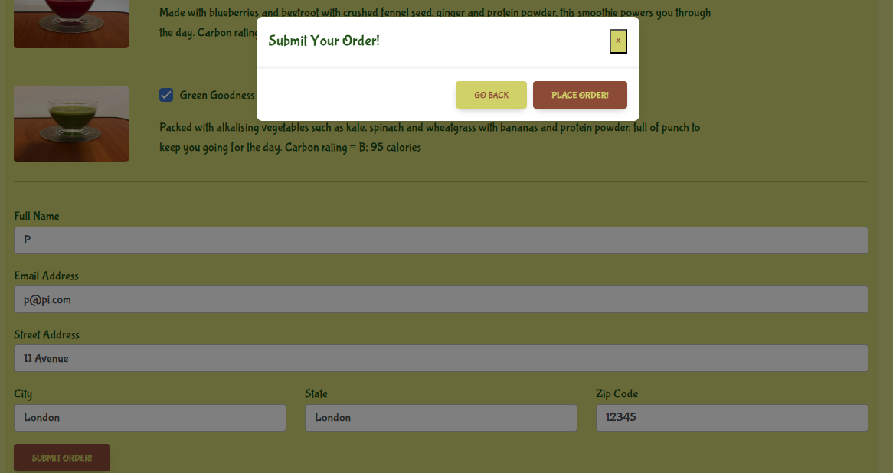

* After the order is placed, a summary of the order is displayed on the screen notifying the Customer that their order will be delivered soon.  

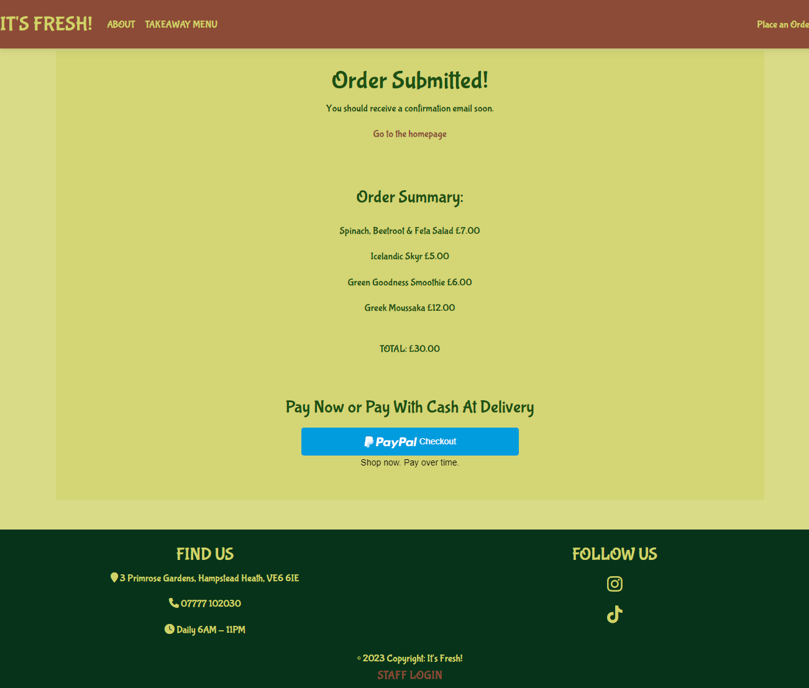

* The Customer is asked whether they want to pay by Paypal (and use that functionality) or cash on delivery.  The blue Paypal button/functionality is displayed (Paypal is not live but sandbox version).  

* If the Customer chooses to pay by Paypal then an automated email is sent by the takeaway to the Customer confirming the payment amount made and once again notifying them of the delivery. 

* If the Customer opts for cash at delivery then the takeaway Staff have to validate the shipping of the order to the Customer (see Dashboard functionality below).

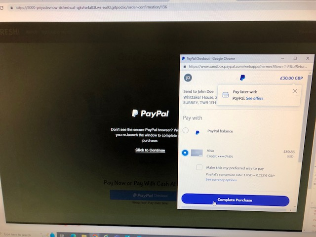

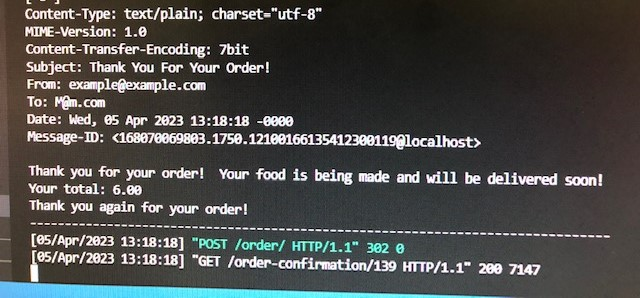

----

## Footer

- The footer shows the contact information and social icons together with bottom centrally placed 'Staff Login' clickable button below the copyright.

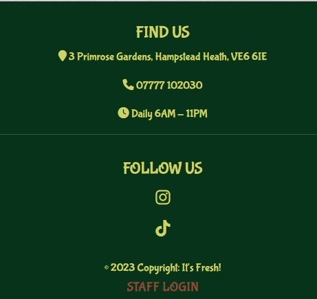

----

## About Page

- The About Page gives users information about the takeway and why it exists.  Each of the 3 pillars explaining this is shown in a separate card.  

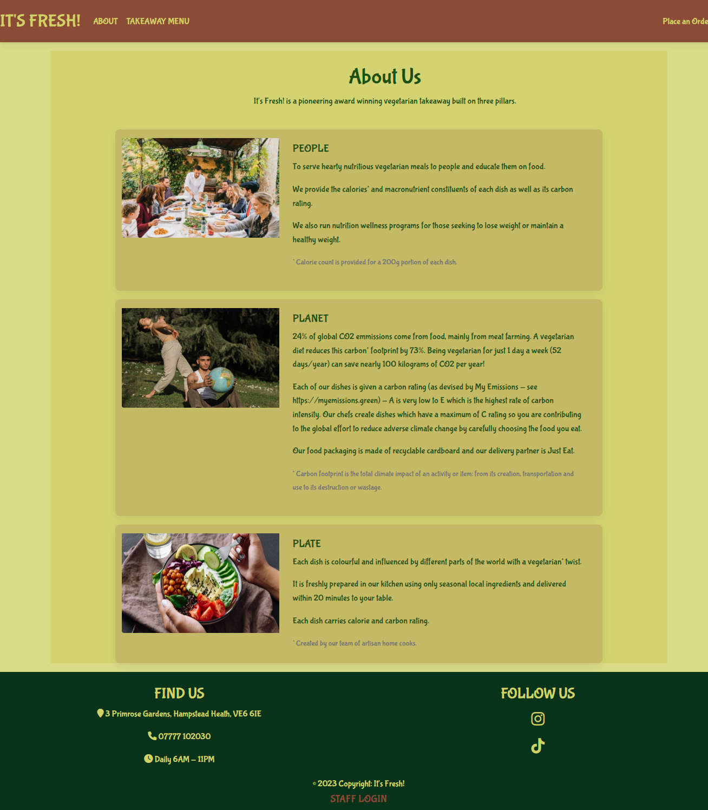

----

## Menu Page with Search Bar

- This page shows all the menu items.  
- It has a search bar for the user to be able to search the menu items for various parameters.

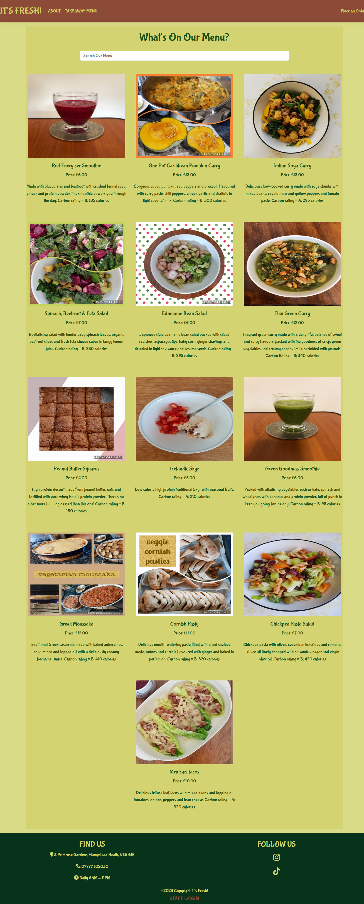

----
# Staff

## Sign In

- When a user clicks on the Home Page Staff Login button in the footer, they are taken to the screen below to sign up or sign in.  For security reasons, only those Staff with permissions given by Admin can Sign In.  Those tring to login without permission will give rise to a 403 Forbidden error.  See example of AtChops (a staff member without ppermission to access the Dashboard) trying to sign in below. 

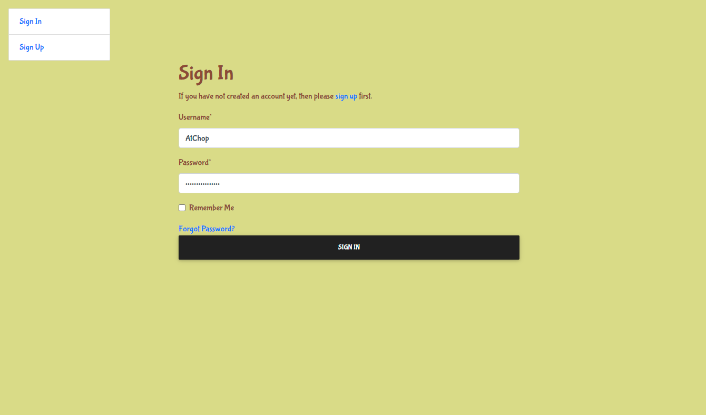
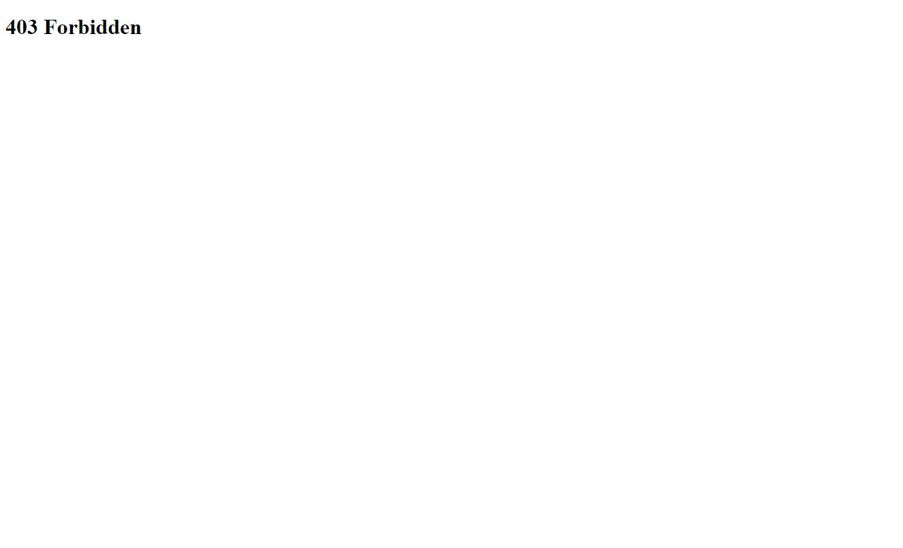

- Sign Up functionality is closed as it is not a relevant feature here since it is only admin who can give permission through Django panel.
- Logout functionality has not yet been built.  Therefore, when a Staff member is signed in they need to be signed out from the the Django panel, otherwise another Staff member is not able to sign in from the footer Staff Login button.   

----

## Dashboard

- Once logged in, permitted Staff can see the Dashboard.  All (unshipped) orders (created in chronological order) are shown on the Dashboard.  
- Staff then check the details of each order by checking the box on the far right of each order on the Dashboard.  Once the order is prepared, Staff can click the the 'Mark as Shipped' box when the order is sent out for delivery. The order is then automatically removed from the Dashboard.  
- The Dashboard also provides a tally of the daily revenues and orders.  

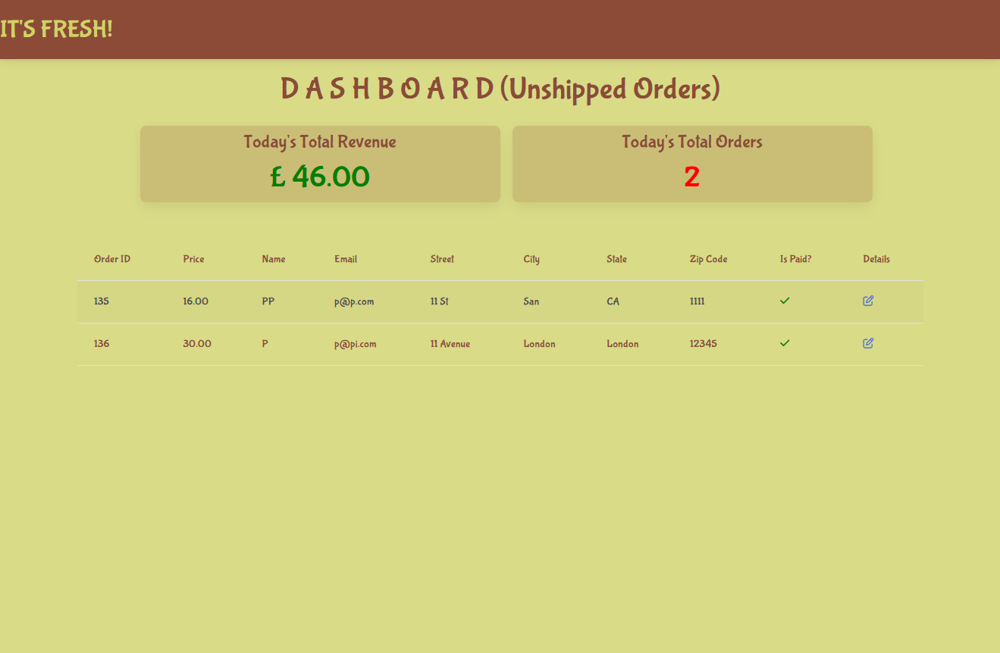
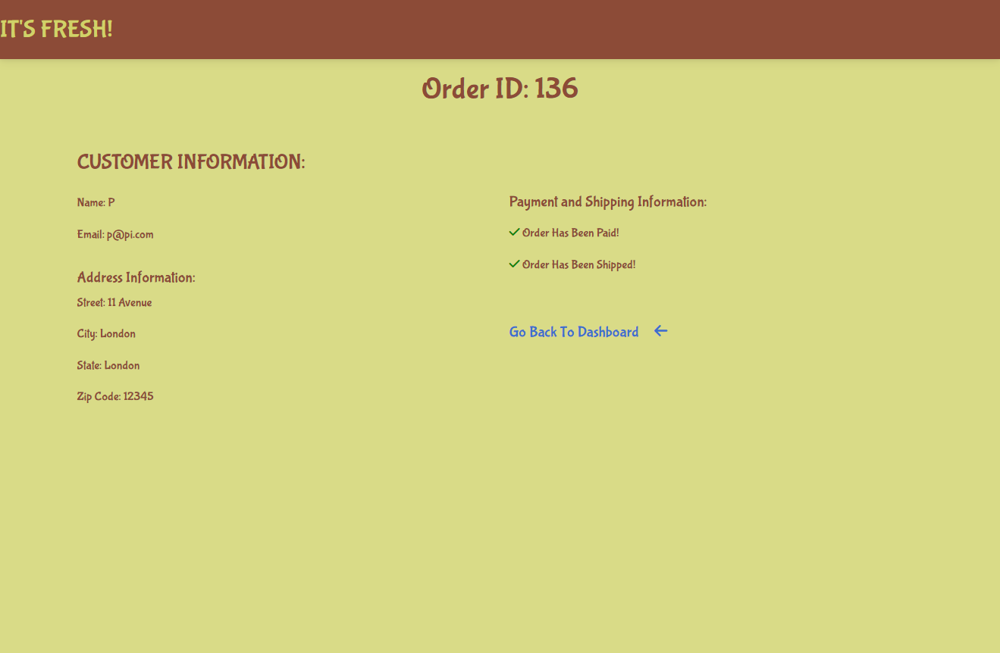

- The Dashboard also flags up orders that have not been paid by putting a red cross in the Paid column and marking this on the actual order.  Staff can decide whether to make the order and ship it if they know that the Customer will pay cash on delivery otherwise not to action further such unpaid orders.
- Similarly staff do not make any orders where no items have been put on the order by a customer (see order 138 below), although this will incorrectly increase the daily total orders tally (a fix for this in the next release will be done).  

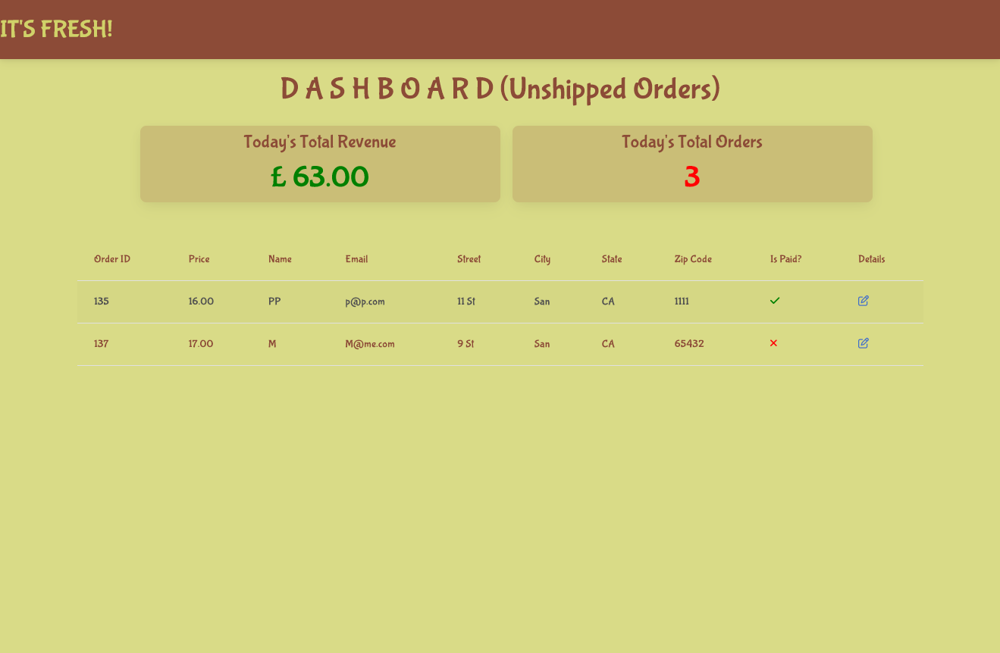

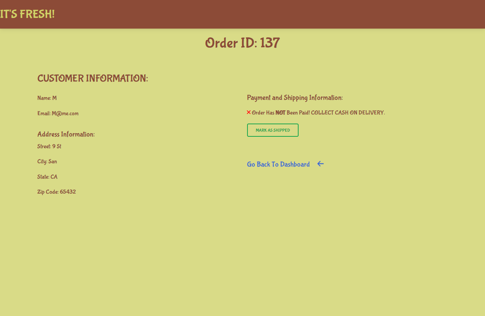
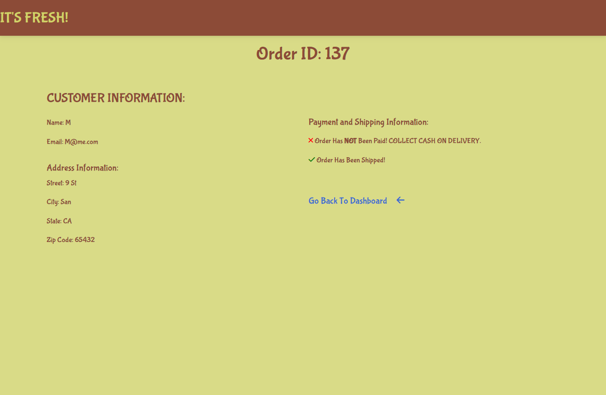
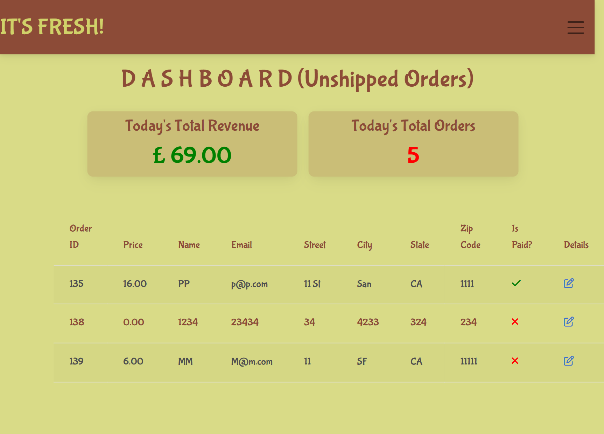

----

# Superuser

## Admin Panel

- Superuser (site admin) accesses the project via logging into Django admin panel with a superuser id and password. The page appears as [here](coderscafe/assets/images/DjangoPanel.png)
- A superuser "admin" was created for this project to manage the admin panel.

- On the Admin Panel, as Superuser I have full access to CRUD functionality so I can view, create, edit and delete the following [Entities](coderscafe/assets/images/DjangoEntities.png):
  - Category
  - Menu item
  - Order models
  - Users - as Admin I can also give certain permissions to specific Staff.

----
[Back to top ⇧](#content)

## Technologies Used

### Languages Used

* [HTML 5](https://en.wikipedia.org/wiki/HTML/)- used to structure all the templates on the site
* [CSS 3](https://en.wikipedia.org/wiki/CSS)- to provide extra styling to the site
* [Python](https://www.python.org/)- to provide the functionality to the site. Packages used in the project can be found in requirements.txt

### Django Packages

* [Allauth](https://django-allauth.readthedocs.io/en/latest/installation.html)- For authentication, registration, account management.
* [Crispy Forms](https://django-crispy-forms.readthedocs.io/en/latest/)- To style the forms.

### Frameworks - Libraries - Programs Used

* [Django](https://www.djangoproject.com/) - as the framework for the back-end logic of the project. Django enables rapid and secure development.
* [UserPersona](https://userpersona.dev/) - to develop user stories for the project
* [MDB](https://mdbootstrap.com/docs/b4/) - Bootstrap version 4 for styling the website, add responsiveness and interactivity
* [Pillow](https://pypi.org/project/Pillow/) - for image processing capabilities 
* [Git](https://git-scm.com/)- for version control by utilizing the Gitpod terminal to commit to Git and push to GitHub
* [GitHub](https://github.com/)- used to store the project's code after being pushed from Git
* [Gitpod](https://www.gitpod.io/) - used as development environment
* [SQLLite](https://sqlite.org/index.html) - database engine
* [Google Chrome Developer Tools](https://developers.google.com/web/tools/chrome-devtools) -  used to inspect page elements, debug, troubleshoot and test features and adjust property values. Using the Lighthouse extension installed in Chrome Browser, the performance report was generated
* [Google Fonts](https://fonts.google.com/) - for the Bubblegum font
* [Font Awesome](https://fontawesome.com/) - to add icons for aesthetic and UX purposes.
* [Lucidchart](https://bit.ly/3nidrjl) - a diagram tool used to create a wireframes for this project
* [ERDplus](https://erdplus.com/) - to create the database model in this project. 
* [Trello](https://trello.com/b/u1DVA6qR/kanban-template) - to vcreat the Kanban board to monitor the progress of this project
- [Amiresponsive](https://ui.dev/amiresponsive) - used to see responsive design 

<!--->
* [PostgreSQL](https://www.postgresql.org/)- Database used through heroku.
* [Balsamiq](https://balsamiq.com/)- To build the wireframes for the project.
* [Heroku](https://id.heroku.com)- Used to deploy the live project.
<!--->
-----

[Back to top ⇧](#content)

## Testing

### Validation
I used the following validation tools to validate CSS and PYTHON codes. HTML could not be validated as it uses the Django framework.   
- CSS using [Jigsaw CSS validator](https://jigsaw.w3.org/css-validator/)
- Python via [PEP8 CI Python Linter](https://pep8ci.herokuapp.com/)

### Manual Testing
Testing has taken place continuously throughout the development of the project. Each view was tested regularly. When the outcome was not as expected, debugging took place at that point. An exhaustive list of features were checked on different devices and browsers. They were performed and their screenshots can be found in the features section on how the distinct features render. All clickable links redirect to the correct pages.

### Behavioural Driven Development (BDD)
BDD results on TESTING.md file:- [Testing Results Here](TESTING.md)

### Test Driven Development (TDD)
Due to lack of time for the completion of this project, there were no automated tests formulated in the test_forms.py. 

### Manual testing

#### All Pages:
TEST            | OUTCOME                          | PASS / FAIL  
--------------- | -------------------------------- | ---------------
Home page | When the "It's Fresh" logo on the far left of the navigation bar is clicked, the browser redirects the user to the home page | PASS
Menu page |When the "takeaway menu" link in the navigation bar is clicked, the browser redirects the user to the menu page.  | PASS
About page | When the "about" link in the navigation bar is clicked, the browser redirects the user to the About page. | PASS
Place an Order button | When the "Place an Order" button in the far right of the navigation bar is clicked, the browser redirects the user to the Order page with menu and checkbox.  | PASS
Place an Order button | When the "Place an Order" button in the center of the Home page is clicked, the browser redirects the user to the Order page with menu and checkbox.  | PASS
Foreground & background colour | Checked foreground information is not distracted by background color or images | PASS
Text | Checked that all fonts and colours used are consistent. | PASS

#### Footer:
TEST            | OUTCOME                          | PASS / FAIL  
--------------- | -------------------------------- | ---------------
Social icons | When the href in the anchor tag for the respective icons is added, a new tab will open and the user will be redirected to the Insttagram and Tiktok sites of the takeaway respectively.  This has been disabled in the current site. | PASS
Location pin | When the location pin is clicked it does not open into Google Map as this is a fictional address. Extra code would need to be writtent to facilitate opening of Google map in a modal | PASS

#### Home:
TEST            | OUTCOME                          | PASS / FAIL  
--------------- | -------------------------------- | ---------------
Media | All media assets are displayed correctly, without any pixelation or stretched images, and are responsive on all devices. | PASS
Responsiveness | All elements on the page have been checked to ensure consistent scalability across mobile, tablet, and desktop views..| PASS
Accessibility |The accessibility of the page has been checked using Lighthouse.| PASS

#### Menu page:
TEST            | OUTCOME                          | PASS / FAIL  
--------------- | -------------------------------- | ---------------
Media | All media assets are displayed correctly, without any pixelation or stretched images, and are responsive on all devices. | PASS
Responsiveness | All elements on the page have been checked to ensure consistent scalability across mobile, tablet, and desktop views.| PASS

#### About page:
TEST            | OUTCOME                          | PASS / FAIL  
--------------- | -------------------------------- | ---------------
Media | All media assets are displayed correctly, without any pixelation or stretched images, and are responsive on all devices. | PASS
Responsiveness | All elements on the page have been checked to ensure consistent scalability across mobile, tablet, and desktop views.| PASS

#### Place an Order page:
TEST            | OUTCOME                          | PASS / FAIL  
--------------- | -------------------------------- | ---------------
Media | All media assets are displayed correctly, without any pixelation or stretched images, and are responsive on all devices. | PASS
Responsiveness | All elements on the page have been checked to ensure consistent scalability across mobile, tablet, and desktop views.| PASS
Accessibility |The accessibility of the page has been checked using Lighthouse.| PASS
Create | Customer can create order by checking dishes and completing form. | PASS
Edit | Customer can go back and check order before submitting. | PASS 
Personal Details form | Checked the form submits only when all required fields are filled out. | PASS
Read | Checked that Customer order is correctly translated into the order summary after Order is submitted by Customer. | PASS
Paypal Button | Checked Customer option to pay by Paypal works | PASS

#### Dashboard:
TEST            | OUTCOME                          | PASS / FAIL  
--------------- | -------------------------------- | ---------------
Login |The Staff Login on Home Page is secure and password controlled. | PASS
Logout | No button provided due to lack of development time so workaround is for Staff logged in to logout using Django Panel.  | FAIL
Media | All media assets are displayed correctly, without any pixelation or stretched images, and are responsive on all devices. | PASS
Responsiveness | All elements on the page have been checked to ensure consistent scalability across mobile, tablet, and desktop views.| PASS
Information | Checked the only permitted Staff can login to see Dashboard.  Checked that information submitted by Customer on the order is picked up.  Checked that Staff can mark order as Shipped.  Checked that the order of orders shownn on Dashboard is on time basis.  | PASS

#### Backend - Django Panel: 
TEST            | OUTCOME                          | PASS / FAIL  
--------------- | -------------------------------- | ---------------
Create, Read, Edit, Delete | The Menu items and Orders can be managed on CRUD basis in the Django panel.  All media assets are displayed correctly, without any pixelation or stretched images, and are responsive on all devices. | PASS
Responsiveness | All elements on the page have been checked to ensure consistent scalability across mobile, tablet, and desktop views.| PASS
Login Logout |The Django panel use is secure and password controlled. | PASS

----

## Bugs

| **Bug** | **Fix** |
| ----------- | ----------- |
| In Menu Page, only 9 menu items could be rendered.  | The views.py file has the code for Menu items which was changed to 
                                                        `'for item in items:
                                                            menu_item = MenuItem.objects.get(pk__exact=int(item))'` |
| Post image was not rendering on post_detail page(Issue only for mobile screens). | Remove class 'd-none' from post_detail page |

| **Unfixed Bug** |
| ----------- | 
| The Home page has white space on the right which I have not been able to get rid off despite Googling and StackOverflowing this matter.  I think it is something to do with css and guttering but I have not been able to succesfully deal with this.  

----

## Future Implementation

* Cancellation of order by Customer
* API owith Just Eat so Customer knows exactly when their order will be delivered
* Blog page and client testimonials
* Staff Logout for Dashboard 
* Automated testing
* Deployment as a fully functional working website

[Back to top ⇧](#content)

<!--->
## Deployment

### 1. Creating the Django Project
* Go to Gitpod and create a new repository and name it `its-fresh`.  
* Once spun up in Gitpopd, type `django admin startproject coderscafe` in the terminal.
* Install Django `pip3 install 'django<4'`
* Create two apps in `cd coderscafe` by typing `python3 manage.py startapp customer` and `python3 manage.py startapp cafe`.  
* Add these two apps to the list of `installed apps` in the settings.py file.
* Migrate changes: `python3 manage.py migrate`.
* Test server works locally: `python3 manage.py runserver`.
* Create superuser to mnage the admin of the site `python3 manage.py createsuperuser` putting in admin name and password credentials.
* Once done start building out the apps.
* 
   
### 2. Create your Heroku app
* Navigate to [Heroku](https://id.heroku.com).
* Create a Heroku account by entering your email address and a password (or login if you have one already).
* Activate the account through the authentication email sent to your email account.
* Click the **new button** on the top right corner of the screen and select create a new app from the dropdown menu.
* Enter a unique name for the application.
* Select the appropriate region for the application.
* Click create app.
* Click Reveal Config Vars and add a new record with `DATABASE_URL`.
* Click Reveal Config Vars and add a new record with `PORT`.
* Click Reveal Config Vars and add a new record with the `DISABLE_COLLECTSTATIC = 1`(note: this must be either removed or set to 0 for final deployment).
* Next, scroll down to the Buildpack section, click `Add Buildpack` select python and click Save Changes.

### 3. Set up Environment Variables
* In you IDE create a new env.py file in the top level directory.
* Add env.py to the .gitignore file.
* In env.py import the os library.
* In env.py add `os.environ["DATABASE_URL"]` = "Paste the link copied from Heroku DATABASE_URL".
* In env.py add `os.environ["SECRET_KEY"] = "Make up your own random secret key"`.
* In Heroku Settings tab Config Vars enter the same `SECRET_KEY` created in env.py by entering 'SECRET_KEY' in the box for 'KEY' and your randomly created secret key in the 'value' box.

* Commit and push the code to the GitHub Repository.

### 5. Heroku Deployment: 
* Click Deploy tab in Heroku.
* Select Github as the deployment method.
* Confirm you want to connect to GitHub.
* Search for the repository name and click the connect button to link the heroku app with the Github repository. The box will confirm that heroku is connected to the repository.
* Scroll to the bottom of the deploy page and select the preferred deployment type.
* Click either Enable Automatic Deploys for automatic deployment when you push updates to Github or To manually deploy click the button 'Deploy Branch'. The default 'main' option in the dropdown menu should be selected in both cases. When the app is deployed a message 'Your app was successfully deployed' will be shown. Click 'view' to see the deployed app in the browser.

### 6. Final Deployment
In the IDE:
* When development is complete change the debug setting to: `DEBUG = False` in `settings.py` 
* In Heroku settings config vars change the `DISABLE_COLLECTSTATIC` value to 0
* Because DEBUG must be switched to True for development and False for production it is recommended that only manual deployment is used in Heroku. 
* To manually deploy click the button 'Deploy Branch'. The default 'main' option in the dropdown menu should be selected in both cases. When the app is deployed a message 'Your app was successfully deployed' will be shown. Click 'view' to see the deployed app in the browser.
<!---->
----

[Back to top](#content)

# Credits

## Code
- [Legion Script](https://www.youtube.com/watch?v=msmtduZfAHo) - the set up of this website follows the food delivery Django project as taught by Legion Script which I found very helpful both in its logical walk through and coding method
 

## Learning Resources
- Code Institutes Full Stack Framework Module.
- [W3CSchool](https://www.w3schools.com/django/)
- [Django Documentation](https://docs.djangoproject.com/en/3.2/ref/models/fields/#field-types)(For different quaries while doing project. For example query about models, fields, form widgets, auth and many more)
- Stackoverflow - had answers to many of my quesries.
- Youtube videos [The Dumbfounds](https://www.youtube.com/playlist?list=PLbpAWbHbi5rMF2j5n6imm0enrSD9eQUaM) for automated testing to be done in the future.

## Content and Media

The menu images are mine.  

The rest of the images were taken from royalty free sites like [Unsplash](https://unsplash.com/) and [Pexels](https://www.pexels.com/).  The hero image is 

Compression of images to help with performace was done using [Tiny PNG editor](https://tinypng.com/).

----

## Acknowledgement

Special thanks to my mentor Sandeep Aggarwal, My fellow student Roshna, Tutor support and Slack community for their assistance throughout this project.

[Back to top](<#content>)
   

