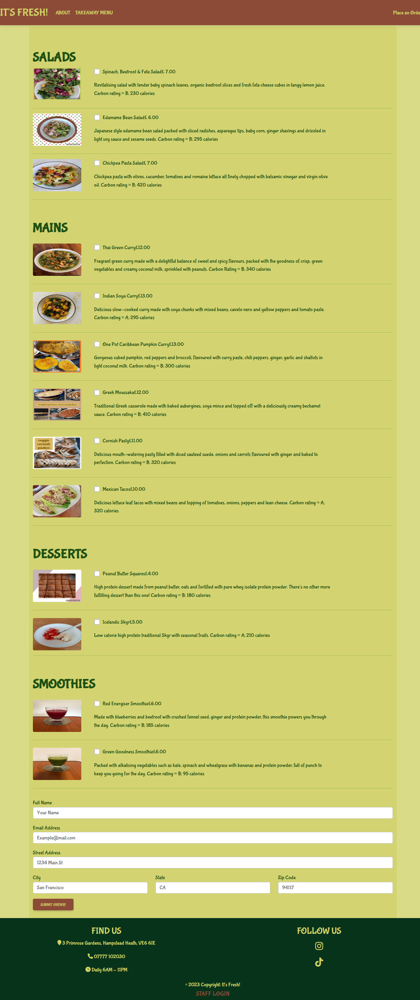

## It's Fresh! - Introduction
----
You can view the live site here:- [It's Fresh!]( https://XXXXXXXXXXX)

**It's Fresh!** is a fictional award-wining vegetarian takeaway located in the trendy Hampstead Heath area of London providing nutritious meals and educating people about the wider impact of the food we consume on ourselves and the environment.  The takeaway website targets **health conscious individuals** who are looking for convenient and reasonably priced vegetarian meal options on a daily basis. 

This website, which resulted from applying the creation process of strategy, scope, structure, skeleton and surface and the design principles, was developed using the Django Framework.  It is my final Portfolio Project for the 2022/23 Full Stack Web App Software Development Bootcamp by Code Institute and Westminster Adult Education Services.
 


----

## [Content](#content)
- [It's Fresh! - Introduction](#its-fresh---introduction)
  - [User Experience - UX](#user-experience---ux)
    - [Site Aims](#site-aims)
    - [Agile Methodology](#agile-methodology)
      - [Epics and User Stories](#epics-and-user-stories)
      - [Tasks](#tasks)
  
  - [Strategy](#strategy)
  - [Scope](#scope)
  - [Structure](#structure)
  - [Skeleton](#skeleton)
    - [Wireframes](#wireframes)
  - [Surface](#surface)  
  - [Design](#design)
    - [Colours](#colours)
    - [Typography](#typography)
    - [Imagery](#imagery)
  - [Database Model](#database-model)
  - [FEATURES](#features)
  - [Customer](#customer)
    - [Home Page](#home-page)
      - [Navigation bar](#navbar)
      - [Place An Order Button](#order-section)
      - [Footer](#footer)
    - [About Page](#about-page)
    - [Menu Page with Search Bar](#menu-page)
  - [Staff](#staff)
    - [Sign In](#signin)
    - [Dashboard](#dashboard)
  - [Superuser](#superuser)
    - [Admin Panel](#admin-panel)
  - [Technologies Used](#technologies-used)
    - [Languages Used](#languages-used)
    - [Django Packages](#django-packages)
    - [Frameworks - Libraries - Programs Used](#frameworks---libraries---programs-used)
  - [Testing](#testing)
      - [Validation](#validation)
      - [Manual Testing](#manual-testing)
  - [Bugs](#bugs)
      - [Fixed Bugs](#fixed-bugs)
      - [Unfixed Bugs](#unfixed-bugs)
  - [Deployment](#deployment)
      - [Creating the Django project](#creating-the-django-project)
      - [Creating Heroku app](#creating-heroku-app)
      - [Set up Environment Variables](#set-up-environment-variables)
      - [Heroku deployment](#heroku-deployment)
      - [Final Deployment](#final-deployment)
  - [Credits](#credits)
    - [Content](#content)
    - [Information Sources / Resources](#information-sources--resources)
  - [Acknowledgement](#acknowledgement)

-----

# User Experience - UX

## Site Aims

* It's Fresh! is a vegetarian takeaway website for busy health and environmentally conscious professionals who are interested in eating intelligently daily.  
* The site is aesthetically pleasing, educative and informative and serves both the Customer (both new and returning) and the takeaway Staff.  It is intuitive to use and quick and easy to navigate for both sets of users.
* The Customer has the ability to order food as well as a tool to search the menu according to various attributes such as price, dish, ingredient, calories, carbon rating, etc. 
* The Customer can create and edit their food order.  
* The takeaway Staff can see the dashboard which sets orders made, whether they are paid and shipped or not and the day's running tally of orders and revenues.  The takeaway staff can sign up and sign in to access the dashboard features.  
* The takeaway Staff can access all the features of the website and can read, create, edit, and delete the menu items.

## Agile Methodology

The Agile Methodology was used to plan this project. This was implemented using Trello where the project was divided into the following sections: 

* To Do - All the user stories were initially entered in the 'To Do' board
* Doing - During the development phase, the stories were moved into the "Doing" board
* Testing - Manual testing was done next and the stories moved to the 'Testing' board
* Done - and then finally they get moved into 'Done' once the development and testing/bug resolution is completed

Please find my Kanban Board with my Customer user stories in progress as at 23 March 2023 [here](coderscafe/assets/images/SnapshotKanbanonTrello26.03.23.png)

## Epics and User Stories

The following Epics were created which were further developed into 18 User Stories.

### Epic 1- Website UI
Epic Goals for Customer - 
* User personas were generated using [User Persona AI](https://userpersona.dev/)
* An intuitive User Interface which is easy to navigate throughout the website 
* Easily see the purpose of the site from the landing page
* View the menu
* Search bar for menu page with quick and easy access to required information

#### Related User Stories:
- Navigation
    - View site navigation:
        - As a **Customer** I can **easily see the purpose of the site from the landing page** so that **I can see if the site is relevant to my needs.**
- Place an order
    - Create Order: 
        - As a **Customer** I can **see the list of all the menu items and their attributes** so that **I can choose what I want to order** 
    - Placing of Order: 
        - As a **Customer** I can **get a second chance** so that **I can decide whether to order as per initial selection or change it**     
    - Confirmation of Order and Making Payment: 
        - As a **Customer** I can **get a confirmation email of the order with payment options** so that **I can decide how to pay** 
    - Confirmation of Payment:
        - As a **Customer** I can **get confirmation of payment I have made** so that **I know that my order has been accepted and when it will be delivered** 
    - Cancellation of Paid Order:
        - As a **Customer** I can **cancel a paid order** so that **I can get a refund** 
    - Customer Login:
        - As a **Customer** I can **login to my account and see previous orders** so that **I do not have to repeat my personal details every time I order and I can repeat my precious orders easily** 
   
- Additional information
    - View About:
        - As a **Customer** I can **read about the ethos of the takeaway** so that **I can see if they meet my values**
    - View Menu:
        - As a **Customer** I can **view the takeaway’s menu** so that **I know what they are currently offering**
        * As a **Customer** I can **use a search bar in the Menu page to search for food items with specific attributes** so that **I can make my ordering decision.**
    - View Blog:
        - As a **Customer** I can **click on the Blog posts page** so that **I can read interesting articles about the menu items created by the takeaway, the impact of different foods on my body and the environment, etc during my leisure time.**
    - View contact information (Footer):
        - As a **Customer** I can **view contact information and the opening hours** so that **I know where the takeaway is and when it is open**
    - View social media (Footer):
        - As a **Customer** I can **view social media links** so that **I can open external links to the restaurant’s social media accounts**

### Epic 2 - Staff Dashboard 
Epic Goals for Staff -
* Easy Sign Up, Sign in and Sign Out
* Update / Read / Delete the Dashboard system of tracking Customer orders 
* View daiy tally of orders and revenue
* Approve for delivery any orders which have not been paid for by the Customer

#### Related User Stories:
- Dashboard system
    - Order management
        - As **Staff** I can **login and logout easily** so I can **see the Dashboard**
        - As **Staff** I can **check the status of any order** so I can **do any necessary update or delete actions for customer orders**
        - As **Staff** I can **view the customer details** so I can **decide whether an unpaid order should be made and delivered for cash**
        - As **Staff** I can **access daily customer orders all in one place** so I can **easily track daily revenues and orders status**
         
          
### Epic 3 - Website Management
Epic Goals for Site Admin -
* Easy registration of an account
* Easy Sign Up, Sign in and Sign Out
* Easy access to Create, Read, Update and Delete (CRUD) features upon signing in
* Give certain permissions to staff
* Visibility of all Customer orders

#### Related User Stories:
- Management
    - Menu management
        - As a **Site admin** I can **create, read, update and delete menu items** so that **I can keep the menu up-to-date** 
    - Managing Customer orders
        - As a **Site admin** I can **create, read, update and delete customer orders** so that **I can manage the entire customer order cycle** 
    - Staff authentication and authorisation
        - As a **Site admin** I can **authorise staff to perform specific functions** so that **I can keep control of staff activities** 


## Tasks
The tasks for the website development process as per the Code Institute method were closely followed.  

## Strategy 
The Strategy Table for Epic 1 is shown below which assisted in evaluating the importanceof the tasks to be done:

Task| Importance| Viability/Feasibility
------------ | -------------------------|---------
Site navigation | 5 | 5
Create Order | 5 | 4
Menu page | 5 | 5
Place Order | 5 | 5
Confirm Order | 5 | 5
Make Payment | 5 | 4
Confirm Payment | 5 | 4
Cancel a Paid Order | 4 | 1
About Page | 5 | 5
Footer with Contact and Socials | 4 | 4
Blog Page | 4 | 1
Customer Login | 2 | 1

## Scope
The strategy table indicates that not all features for Epic 1 could be immediately implemented in the initial release of the project. So the ability to cancel a paid order, provide a Customer login and set up a Blog page have been deferred to the next release. Thus, this initial release focussed on the rest of the tasks of Epics 1, 2 and 3 which incorporate the essential features necessary to create the minimum viable product.

The tasks that I have done during the development phase of the website were carried out in this order.

**Before Project Inception**

- Design ERD and Data 
- Create Repository in GitHub
- Create Project, Epics, User Stories and prepare Kanban Board

**Creation of Project in GitPod**

- Create the django project with `pip3 install 'django<4'`. Check details in [deployment-section](#deployment)

- Deploying app to Heroku - Details in [deployment](#deployment) section <<<<<<>>>>>>

- Create Database Models
	- Set up models.py file in "Customer" directory

- Set up Templates in ""Customer" directory
	- Create base.html - Navbar and Footer content, which gets extended to all the other template files
	- Add responsiveness to navigation.html and footer.html
    - Create index.html (and also create static/customer with images for photos and site.css for style)
	- Set up template file features with views.py and urls.py
    - about.html (Description about It's Fresh!)
    - menu.html (to view all menu items)
    - order.html (for Customer to make order)
    - order_confirmation.html (for Customer to receive summary of their order and payment details)
    - order_pay_confirmation.html (for Customer to receive payment confirmation if they pay using Paypal)

- Set up Templates in "Cafe" directory
	- Replicate base.html from "Customer" directory 
    - Replicate navigation.html from "Customer" directory 
    - Create dashboard.html (shows tally of daily reveues and orders and the details of all unshipped orders in table format)
    - Create order-details.html (sets out customer details, payment and shipping instructions)
    - Set up template file features with views.py and urls.py

- Build Admin Site using the Django framework

- Install Allauth for sign in, sign up and sign out templates with `pip3 install django-allauth` 

- Install crispy-forms to add styles to Django account templates with `pip3 install crispy-bootstrap4` and `pip3 install crispy-forms==2.0`
- Install Pillow to allow image procesing in Python with `pip3 install Pillow==9.4.0`

- Intensive Manual Testing and Validation checks of each page and codes written (unfortunately due to lack of time no automated tests were coded in tests.py)

- Final Deployment steps

## Structure

The structure of the website was limited to 3 pages, populated with essential information.  However, the interactve nature of the website - with apps for Customer and Staff respectively - was facilitated by individual smaller html pages.  

## Skeleton

**Wireframes**

The wireframes which provided the skeleton for this project were generated using [LucidChart](https://lucid.app/documents#/templates?folder_id=home). 
- [Wireframe for Home Page](coderscafe/assets/images/Home_page_wireframe.jpeg)
- [Wireframe for About Page](coderscafe/assets/images/About_page_wireframe.jpeg)
- [Wireframes for Menu Page](coderscafe/assets/images/Menu_page_wireframe.jpeg)

## Surface

A design was created that allowed a seamless flow through the website with the use of consistent colours, typography and carefully selected appealing images.

[Back to top ⇧](#content)

-----

## Design

### Colours

The underlying theme of the takeaway is to serve wholesome vegetarian food and thus the colour palette from [Scheme Colour](https://www.schemecolor.com/) chosen comprised of greens and brown.  The colour scheme was consistently maintained throughout the website as background and text colours with contrasting colours used to enhance visual clarity.  


### Typography

Following a Google search of the top 10 restaurant fonts, the Bubblgum font (ranking as number 4) was imported using Google Fonts. It is described as "an upbeat, flavor-loaded, brushalicious letters for the sunny side of the street. It bounces with joy and tells a great story" and so perfectly married with the purpose of It's Fresh!.  Bubblegum was used throughout the website with a backup of sans-serif. 

It is easily legible for users.


### Imagery

Except for the menu items which are all photos taken by me, the remainining imagery has been sourced from royalty free photo sites.  A limited number of simple evocative photos were chosen for the site.  FontAwesome icons have also been used.


----

## Database Model

This project was built with the Django Framework. Django is a Python based framework designed to create web applications, and it encourages rapid development. Django is based on Model-View-Template (MVT) architecture. MVT is a software design pattern for developing a web application. It consists of the following three entities:

- The **Model** manages the data and is represented by a database. A model is basically a database table.
- The **View** receives HTTP requests and sends HTTP responses. A view interacts with a model and template to complete a response.
- The **Template** is basically the front-end layer and the dynamic HTML component of a Django application.

## ERD  

[ERDPlus](https://erdplus.com/standalone) was used during the planning stage to create a database schema to visualise the types of custom models the project requires. Creating a schema in the form of such a visual diagram helped me gain a clearer understanding of what needed to be added to each model.  The relationship between the Entities Category, MenuItem, Order and Customer are shown in the diagram below.  Unfortunately due to time constraints the Customer Entity was not pursued and the attributes attached to it were transferred to Order. Below is the Database structure that this project is based on. 


[Back to top ⇧](#content)

----

# FEATURES

# Customer 

## Home Page

- The site opens to show the text 'Online Food Delivery Service' against a full size background hero image of bowls of food and glass with drink.  
- There is a clickable centrally positioned 'Place an Order' button in the centre of the hero image.  
- The navigation bar from the left shows the logo (which is simply the name of the takeaway), About page link and Takeaway Menu page links and on the far right another call to action clickable button named 'Place an Order'.  
- The footer shows the contact information and social icons together with bottom centrally placed 'Staff Login' clickable button below the copyright.  
- The Home Page is responsive.  On smaller screens, the central 'Place an Order' button spans the width of the screen, the navigation bar turns into a hamburger and the footer vertically aligns the information.   

<details closed>


</details>

----

## Navigation Bar 

- The navigation bar is present at the top of every page and navigates all links to the respective pages.
- The navigation bar from the left shows the logo (which is simply the name of the takeaway), About page link and Takeaway Menu page links and on the far right another call to action clickable button named 'Place an Order'.
- The navigation bar is fully responsive, collapsing into a hamburger menu when the screen size becomes smaller.

<details closed>


</details>

----

## Place an Order Button

* When the Order Now button on the Place an Order card is clicked on the Home Page or navbar, the order form is displayed.  The order form shows all menu items with checkboxes and input for personal details of the user/Customer.
<details closed>

 

</details>

* When the user clicks the Submit Order button the following modal opens asking whether user wants to Place Order or Go Back giving the Customer a second chance to check their order.
<details closed>


</details>

* After the order is placed, a summary of the order is displayed on the screen notifying the Customer that their order will be delivered soon.  
<details closed>


</details>

* The Customer is asked whether they want to pay by Paypal (and use that functionality) or cash on delivery.  The blue Paypal button/functionality is displayed (Paypal is not live but sandbox version).  

* If the Customer chooses to pay by Paypal then an automated email is sent by the takeaway to the Customer confirming the payment amount made and once again notifying them of the delivery. 

* If the Customer opts for cash at delivery then the takeaway Staff have to validate the shipping of the order to the Customer (see Dashboard functionality below).

<details closed>


</details>

----

## Footer

- The footer shows the contact information and social icons together with bottom centrally placed 'Staff Login' clickable button below the copyright.

<details closed>


</details>

----

## About Page

- The About Page gives users information about the takeway and why it exists.  Each of the 3 pillars explaining this is shown in a separate card.  

<details closed>


</details>

----

## Menu Page with Search Bar

- This page shows all the menu items.  
- It has a search bar for the user to be able to search the menu items for various parameters.

<details closed>


</details>

----
# Staff

## Sign In

- When a user clicks on the Home Page Staff Login button in the footer, they are taken to the screen below to sign up or sign in.  For security reasons, only those Staff with permissions given by Admin can Sign In.  Those tring to login without permission will give rise to a 403 Forbidden error.  See example of AtChops (a staff member without ppermission to access the Dashboard) trying to sign in below. 

<details closed>


</details>

- Sign Up functionality is closed as it is not a relevant feature here since it is only admin who can give permission through Django panel.
- Logout functionality has not yet been built.  Therefore, when a Staff member is signed in they need to be signed out from the the Django panel, otherwise another Staff member is not able to sign in from the footer Staff Login button.   

----

## Dashboard

- Once logged in, permitted Staff can see the Dashboard.  All (unshipped) orders (created in chronological order) are shown on the Dashboard.  
- Staff then check the details of each order by checking the box on the far right of each order on the Dashboard.  Once the order is prepared, Staff can click the the 'Mark as Shipped' box when the order is sent out for delivery. The order is then automatically removed from the Dashboard.  
- The Dashboard also provides a tally of the daily revenues and orders.  
<details closed>


</details>

- The Dashboard also flags up orders that have not been paid by putting a red cross in the Paid column and marking this on the actual order.  Staff can decide whether to make the order and ship it if they know that the Customer will pay cash on delivery otherwise not to action further such unpaid orders.
- Similarly staff do not make any orders where no items have been put on the order by a customer (see order 138 below), although this will incorrectly increase the daily total orders tally (a fix for this in the next release will be done).  

<details closed>


</details>

----


# Superuser

## Admin Panel

- Admin accesses the project via logging into Django admin panel with a superuser id and password. The page appears as shown [here](assets/features/admin-panel-login.jpg).
- A superuser "admin" was created for this project to manage the admin panel.
- On the Admin Panel, as an admin I have full access to CRUD functionality so I can view, create, edit and delete the following Entities:
  - Category
  - Menu-Item
  - Order
- As admin I can also give certain permissions to specific Staff.

### Admin 'Post' Model Management

- On selecting Blog "Post", a list of blog posts is displayed with its title, slug, status, created_on and author name. Admin can select the post and edit or delete its data.
- When a blog post is submitted by a user, its status is set to Draft by default.
- When the status is set to Publish on Admin Approval, the post starts appearing in the website.

The admin site for post model appears as shown [here](assets/features/admin-panel-post-model.jpg).

### Admin 'Comment' Model Management

- Upon selecting the Blog "Comment" model, a list of comments on a post is displayed with the username, comment body, post title, status and created_on. Admin can select the comment and edit or delete its data.
- When a comment is submitted by a user, it requires approval from an admin in order to publish it on the comments section.

The admin site for comment model appears as shown [here](assets/features/admin-panel-comment-model.jpg).

### Admin 'Destination' Model Management

- On selecting the Blog "Destination" model, a list of destinations for the blog post is displayed with title, slug and excerpt fields. Only Admin can add, edit or delete any destination data.

The admin site for destination model appears as shown [here](assets/features/admin-panel-destination-model.jpg).

[Back to top ⇧](#content)
----

## Technologies Used

### Languages Used

* [HTML 5](https://en.wikipedia.org/wiki/HTML/)- Used to structure all the templates on the site
* [CSS 3](https://en.wikipedia.org/wiki/CSS)- to provide extra styling to the site
* [JavaScript](https://www.javascript.com/)- Minimum javascript was used to fade out alerts after a few seconds.
* [Python](https://www.python.org/)- To provide the functionality to the site. Packages used in the project can be found in requirements.txt

### Django Packages

* [Gunicorn](https://gunicorn.org/)- As the server for Heroku.
* [Cloudinary](https://cloudinary.com/)- Was used to host the static files and media for the site.
* [Dj_database_url](https://pypi.org/project/dj-database-url/)- To parse the database URL from the environment variables in Heroku.
* [Psycopg2](https://pypi.org/project/psycopg2/)- As an adaptor for Python and PostgreSQL databases.
* [Summernote](https://summernote.org/)- As a text editor.
* [Allauth](https://django-allauth.readthedocs.io/en/latest/installation.html)- For authentication, registration, account management.
* [Crispy Forms](https://django-crispy-forms.readthedocs.io/en/latest/)- To style the forms.

### Frameworks - Libraries - Programs Used

* [Django](https://www.djangoproject.com/) was used as the framework for the back-end logic of the project. Django enables rapid and secure development.
* [Bootstrap](https://getbootstrap.com/)- Used to style the website, add responsiveness and interactivity.
* [Git](https://git-scm.com/)- Used for version control by utilizing the Gitpod terminal to commit to Git and push to GitHub.
* [GitHub](https://github.com/)- Used to store the project's code after being pushed from Git.
* [Heroku](https://id.heroku.com)- Used to deploy the live project.
* [PostgreSQL](https://www.postgresql.org/)- Database used through heroku.
* [Balsamiq](https://balsamiq.com/)- To build the wireframes for the project.
* [Google Chrome Developer Tools](https://developers.google.com/web/tools/chrome-devtools) was used to inspect page elements, debug, troubleshoot and test features and adjust property values. Using the Lighthouse extension installed in Chrome Browser, the performance report was generated.
* [Google Fonts:](https://fonts.google.com/) used for the Bubblegum font
* [Font Awesome:](https://fontawesome.com/) was used to add icons for aesthetic and UX purposes.

-----

[Back to top ⇧](#content)

## Testing

### Validation
I used the following validation tools to validate HTML, CSS, PYTHON codes. Below the link of TESTING.md file, which includes all validation results.  
- HTML using [W3C HTML validator](https://validator.w3.org/)
- CSS using [Jigsaw CSS validator](https://jigsaw.w3.org/css-validator/)
- Python via [PEP8 CI Python Linter](https://pep8ci.herokuapp.com/)

### Manual Testing
Testing has taken place continuously throughout the development of the project. Each view was tested regularly. When the outcome was not as expected, debugging took place at that point. An exhaustive list of features were checked on different devices and browsers. They were performed and their scrrenshots can be found in the features section on how the distinct features render. All clickable links redirect to the correct pages.

- Link for TESTING.md file:- [Testing Results Here](TESTING.md)

### Test Driven Development

Due to lack of time, there were no automated tests formulated in the test_forms.py. 

### Manual testing

#### All Pages:
TEST            | OUTCOME                          | PASS / FAIL  
--------------- | -------------------------------- | ---------------
Home page | When the "home" button in the navigation bar is clicked, the browser redirects the user to the home page and the "active" styling appears on the home button | PASS
Menu page |When the "menu" button in the navigation bar is clicked, the browser redirects the user to the menu page and the "active" styling appears on the menu button.  | PASS
Contact page | When the "contact" button in the navigation bar is clicked, the browser redirects the user to the contact page and the "active" styling appears on the contact button. | PASS
Table bookingpage | When the "Table booking" button in the navigation bar is clicked, the browser redirects the user to the Table booking page and the "active" styling appears on the Table booking button.| PASS
My booking page | When the "My booking" button in the navigation bar is clicked, the browser redirects the user to the My booking page and the "active" styling appears on the My booking button. | PASS
Edit profile page | Checked foreground information is not distracted by backgrounds| PASS
Register page |  When the "Register" button in the navigation bar is clicked, the browser redirects the user to the Register page and the "active" styling appears on the Register button. | PASS
Foreground & background colour | Checked foreground information is not distracted by background color or images | PASS
Text | Checked that all fonts and colours used are consistent. | PASS

#### Footer
TEST            | OUTCOME                          | PASS / FAIL  
--------------- | -------------------------------- | ---------------
Facebook | When the Facebook icon is clicked, a new tab will open and the user will be redirected to the Facebook website. | PASS
Instagram | When the Instagram icon is clicked, a new tab will open and the user will be redirected to the Instagram website. | PASS

#### Home
TEST            | OUTCOME                          | PASS / FAIL  
--------------- | -------------------------------- | ---------------
Media | All media assets are displayed correctly, without any pixelation or stretched images, and are responsive on all devices. | PASS
Responsiveness | All elements on the page have been checked to ensure consistent scalability across mobile, tablet, and desktop views..| PASS
Accessibility |The accessibility of the page has been checked using Lighthouse.| PASS
Carrousel | The links in the carousel are functional and take the user to the correct pages. | PASS
Carrousel login | The information displayed in the carousel is dynamic and depends on the user's login status. | PASS

Lightouse:


#### Menu page
TEST            | OUTCOME                          | PASS / FAIL  
--------------- | -------------------------------- | ---------------
Media | All media assets are displayed correctly, without any pixelation or stretched images, and are responsive on all devices. | PASS
Responsiveness | All elements on the page have been checked to ensure consistent scalability across mobile, tablet, and desktop views.| PASS
Accessibility |The accessibility of the page has been checked using Lighthouse.| PASS

Lightouse:


#### Contact page
TEST            | OUTCOME                          | PASS / FAIL  
--------------- | -------------------------------- | ---------------
Map | The map asset is displayed correctly, without any pixelation or stretched images, and is responsive on all devices. | PASS
Responsiveness | All elements on the page have been checked to ensure consistent scalability across mobile, tablet, and desktop views.| PASS
Accessibility |The accessibility of the page has been checked using Lighthouse.| PASS

Lightouse:


#### Sign Up page
TEST            | OUTCOME                          | PASS / FAIL  
--------------- | -------------------------------- | ---------------
Media | All media assets are displayed correctly, without any pixelation or stretched images, and are responsive on all devices. | PASS
Responsiveness | All elements on the page have been checked to ensure consistent scalability across mobile, tablet, and desktop views.| PASS
Accessibility |The accessibility of the page has been checked using Lighthouse.| PASS
Register form | Checked the form submits only when all required fields are filled out. | PASS
Sign in link | Checked the sign-in link redirects to the sign-in page. | PASS

Lightouse:


#### Log in page
TEST            | OUTCOME                          | PASS / FAIL  
--------------- | -------------------------------- | ---------------
Media | All media assets are displayed correctly, without any pixelation or stretched images, and are responsive on all devices. | PASS
Responsiveness | All elements on the page have been checked to ensure consistent scalability across mobile, tablet, and desktop views.| PASS
Accessibility |The accessibility of the page has been checked using Lighthouse.| PASS
Sign in form | Checked the form submits only when all required fields are filled out. | PASS
Signup link | Checked the signup link redirects to the signup page. | PASS

Lightouse:


#### Book table page
TEST            | OUTCOME                          | PASS / FAIL  
--------------- | -------------------------------- | ---------------
Media | All media assets are displayed correctly, without any pixelation or stretched images, and are responsive on all devices. | PASS
Responsiveness | All elements on the page have been checked to ensure consistent scalability across mobile, tablet, and desktop views.| PASS
Accessibility |The accessibility of the page has been checked using Lighthouse.| PASS
Form | Checked the form submits only when all required fields are filled out. | PASS
Date picker | When a date is selected, all reservations made for that day are displayed.| PASS

Lightouse:


#### My bookings page
TEST            | OUTCOME                          | PASS / FAIL  
--------------- | -------------------------------- | ---------------
Media | All media assets are displayed correctly, without any pixelation or stretched images, and are responsive on all devices. | PASS
Responsiveness | All elements on the page have been checked to ensure consistent scalability across mobile, tablet, and desktop views.| PASS
Accessibility |The accessibility of the page has been checked using Lighthouse.| PASS
Dropdown | Clicking on a reservation activates the dropdown, showing the edit and delete button. | PASS
Edit |Clicking on the edit button takes you to the edit page. | PASS
Delete |When the delete button is clicked, a modal appears to confirm the action before it is executed. | PASS
No reservation |A button linking to the book table page is present and functional.| PASS

Lightouse:


#### Edit table page
TEST            | OUTCOME                          | PASS / FAIL  
--------------- | -------------------------------- | ---------------
Media | All media assets are displayed correctly, without any pixelation or stretched images, and are responsive on all devices. | PASS
Responsiveness | All elements on the page have been checked to ensure consistent scalability across mobile, tablet, and desktop views.| PASS
Accessibility |The accessibility of the page has been checked using Lighthouse.| PASS
Form | Checked the form submits only when all required fields are filled out. | PASS

Lightouse:


----

## Bugs

| **Bug** | **Fix** |
| ----------- | ----------- |
| In navbar, the menu item destination dropdown was not populating.| Create destination_list view that return context (destination_list) then add `'blog.views.destinations_list'` in templates section in settings.py file |
| Post image was not rendering on post_detail page(Issue only for mobile screens). | Remove class 'd-none' from post_detail page |
| Alert messages was not disappeare after setTimeOut(2000)<br><details><summary>Alert Code</summary></details> | Copy code from bootstrap alert and customize with forEach <br><details><summary>New Alert Code</summary></details>|
| Destination dropdown was again not populating. | Remove script scr 'bootstrap.min.js' because there is already 'bootstrap.bundle.min.js' |
| Automated test was not working because of postgres database | Connect with local db.sqlite3 while running unit test<br><details><summary>Override database for unit test</summary></details>  |


| **Unfix Bug** |
| ----------- | 
| When a logged in user adds a new post, the post slug should automatically be created from the post title. But the slug field is empty in the database. Slug is a required field when admin publishes a draft post, so here admin manually filled the slug field during publishing. Below is the screenshot from the post model in admin panel and view for Add Post.<br><details><summary>Empty slug screenshot</summary></details><details><summary>Add Post View</summary></details> 

----

## Future Implementation

* Automated testing for views functions 
* Adding and displaying replies below corresponding comments on our blog

[Back to top ⇧](#content)


## Deployment

### 1. Creating the Django Project
* Go to Gitpod and create a new repository and name it `its-fresh`.  
* Once spun up in Gitpopd, type `django admin startproject coderscafe` in the terminal.
* Install Django `pip3 install 'django<4'`
* Create two apps in `cd coderscafe` by typing `python3 manage.py startapp customer` and `python3 manage.py startapp cafe`.  
* Add these two apps to the list of `installed apps` in the settings.py file.
* Migrate changes: `python3 manage.py migrate`.
* Test server works locally: `python3 manage.py runserver`.
* Create superuser to mnage the admin of the site `python3 manage.py createsuperuser` putting in admin name and password credentials.
* Once done start building out the apps.
* 

<<<<>>>>>  ### 2. Create your Heroku app
* Navigate to [Heroku](https://id.heroku.com).
* Create a Heroku account by entering your email address and a password (or login if you have one already).
* Activate the account through the authentication email sent to your email account.
* Click the **new button** on the top right corner of the screen and select create a new app from the dropdown menu.
* Enter a unique name for the application.
* Select the appropriate region for the application.
* Click create app.
* Click Reveal Config Vars and add a new record with `DATABASE_URL`.
* Click Reveal Config Vars and add a new record with `PORT`.
* Click Reveal Config Vars and add a new record with the `DISABLE_COLLECTSTATIC = 1`(note: this must be either removed or set to 0 for final deployment).
* Next, scroll down to the Buildpack section, click `Add Buildpack` select python and click Save Changes.

### 3. Set up Environment Variables
* In you IDE create a new env.py file in the top level directory.
* Add env.py to the .gitignore file.
* In env.py import the os library.
* In env.py add `os.environ["DATABASE_URL"]` = "Paste the link copied from Heroku DATABASE_URL".
* In env.py add `os.environ["SECRET_KEY"] = "Make up your own random secret key"`.
* In Heroku Settings tab Config Vars enter the same `SECRET_KEY` created in env.py by entering 'SECRET_KEY' in the box for 'KEY' and your randomly created secret key in the 'value' box.


* Commit and push the code to the GitHub Repository.?????

### 5. Heroku Deployment: 
* Click Deploy tab in Heroku.
* Select Github as the deployment method.
* Confirm you want to connect to GitHub.
* Search for the repository name and click the connect button to link the heroku app with the Github repository. The box will confirm that heroku is connected to the repository.
* Scroll to the bottom of the deploy page and select the preferred deployment type.
* Click either Enable Automatic Deploys for automatic deployment when you push updates to Github or To manually deploy click the button 'Deploy Branch'. The default 'main' option in the dropdown menu should be selected in both cases. When the app is deployed a message 'Your app was successfully deployed' will be shown. Click 'view' to see the deployed app in the browser.

### 6. Final Deployment
In the IDE:
* When development is complete change the debug setting to: `DEBUG = False` in `settings.py` 
* In Heroku settings config vars change the `DISABLE_COLLECTSTATIC` value to 0
* Because DEBUG must be switched to True for development and False for production it is recommended that only manual deployment is used in Heroku. 
* To manually deploy click the button 'Deploy Branch'. The default 'main' option in the dropdown menu should be selected in both cases. When the app is deployed a message 'Your app was successfully deployed' will be shown. Click 'view' to see the deployed app in the browser.

----

[Back to top](#content)

# Credits

## Code
- The basic set up of the website was done by strictly following the steps as described in Code Institue Full Stack Frameworks module - Django walkthrough project `"I Think Therefore I Blog"`.
- Followed the project of one of my friend who is also a CI student (Roshana Vakeel): https://github.com/RoshnaVakkeel/Little_Learners_Lab_Logs/blob/main/logs/forms.py 
- Another project link I found from Linkdin, also CI's student (Laura Mayock): https://github.com/LauraMayock/The-happy-reader
- [The Newsbox](https://github.com/rashdogg74/newsbox86)- One of the project shared by my cohort facilitator on Slack. 

## Learning Resources
- Code Institutes Full Stack Framework Module, mainly the 'blog' walkthrough project.
- Youtube videos by [Codemy](https://www.youtube.com/watch?v=6-XXvUENY_8&list=PLCC34OHNcOtr025c1kHSPrnP18YPB-NFi&index=5)
- [W3CSchool](https://www.w3schools.com/django/)
- [Django Documentation](https://docs.djangoproject.com/en/3.2/ref/models/fields/#field-types)(For different quaries while doing project. For example query about models, fields, form widgets, auth and many more)
- Other open source to understand and solve following types of error : UnboundedLocalError, MultivalueDictKeyError,  ProgrammingError, InvalidCursorName etc.
- Youtube videos [The Dumbfounds](https://www.youtube.com/playlist?list=PLbpAWbHbi5rMF2j5n6imm0enrSD9eQUaM) for automated testing.

## Content and Media

Mostly images and post content are taken from the website https://www.holidify.com/ and https://www.incredible-india.org/. Some images are taken from [Pexels](https://www.pexels.com/).

----

## Acknowledgement

Special thanks to my mentor Sandeep Aggarwal, My fellow student Roshna, Tutor support and Slack community for their assistance throughout this project.

[Back to top](<#content>)
   


\\\\\\\\\\\------

   # Skafferiet Restaurant

Skafferiet is a local (not real) restaurant, based in central Stockholm, Sweden. 

*At Skafferiet we serve our interpretation of modern bistro fare, hearty and uncomplicated dishes, many of which are for sharing by two or more. Skafferiet is a natural rendezvous with a mixed crowd, a friendly restaurant you can frequent visit.*

The restaurants website targets curious people seeking to enjoy modern cuisine presented in a fun and simple but elegant manner in an vibrant environment. 

The live site can be found here: [Skafferiet](https://best-rest.herokuapp.com/)


# Table of contents
1. [UX-Design](#ux-design)
    - [Planning](#planning)
        - [Design Thinking](#design-thinking)
        - [User Stories](#user-stories)
        - [Website flow](#website-flow)
    - [Wireframe](#wireframe)
        - [Style and colors](#style-and-colors)
2. [Database Model](#database-model)
    - [ERD](#erd)
3. [Features](#features)
    - [Existing Features](#existing-features)
4. [Technologies Used](#technologies-used)
    - [Languages](#languages)
    - [Frameworks, Libraries and Programs](#frameworks-libraries-and-programs)
    - [Tools](#tools)
5. [Manual Testing](#manual-testing)
    - [Responsiveness](#responsiveness)
    - [Browser Compability Testing](#browser-compability-testing)
    - [Lighthouse Testing](#lighthouse-testing)
    - [Code Validation](#code-validation)
    - [User Stories Testing](#user-stories-testing)
    - [Features Testing](#features-testing)
    - [Bugs](#bugs)
6. [Deployment](#deployment)
7. [Future Improvements](#future-improvements)
8. [References](#references)
    - [Code Content](#code-content)
    - [Media](#media)
    - [Design Tools](#design-tools)
    - [Acknowledgements](#acknowledgements)

# UX-Design
## Planning
### Design thinking
When I began working on this project I tried to put myself in the users position, trying to imagine what a users wants and needs are in a website for a restaurant. 

I first posed two important questions imagined being answered by both a user of the website and guest of the restaurant: 
- Why would a user want to visit our restaurants website?
    - *To discover the restaurant, view the menu, book a reservation, find contact and opening hours information.*
- What will make them return?
    - *A pleasant experience of both the physical restaurant and websites pleasant UX (i.e. clear navigation, easy to book/manage reservation).*

Examining the answers of these questions, I could follow up with a final question, also imagined being answered by a user: 
- What do I want to see when I visit a restaurants website?
    - *Restaurant name, contact info, opening hours, booking functionality and menu.*

By posing these three important questions, I could now base my user stories on the answers.

### User stories
Below are the user stories in their epics created for this project. They have been implemented and worked with in GitHub Project connected to this projects repository.

As a site user: 

- Navigation
    - View site navigation:
        - As a **Site user** I can **view options to make a new reservation or manage an existing reservation** so that **I can choose where to navigate to on the website** 
- Create a reservation
    - Create reservation: 
        - As a **logged in Site user** I can **create a reservation** so that **I have a reserved time and date at the restaurant** 
    - Party number: 
        - As a **Site user** I can **view the options for the number of people to reserve for** so that **I can select the amount of people in my party**
    - Enter date:
        - As a **Site user** I can **enter a date** so that **I can select which date to make a reservation** 
    - Available times:
        - As a **Site user** I can **view a list of available times on available dates** so that **I can select what time to make a reservation** 
    - Add name and email:
        - As a **Site user** I can **register a first name, last name and an email address** so that **I can make a reservation** 
- Authentication and managing a reservation 
    - Register account:
        - As a **Site user** I can **register an account** so that **I can create a reservation**
    - View reservations: 
        - As a **logged in Site user** I can **view a list of my reservations** so that **I can decide which reservation to manage** 
    - Manage reservation:
        - As a **Site user** I can **enter user details** so that **I can create a reservation or read, update or delete my existing reservation** 
- Additional information
    - View menu:
        - As a **Site user** I can **view the restaurant’s menu** so that **I know what they are currently offering**
    - View contact information:
        - As a **Site user** I can **view contact information and the opening hours** so that **I know where the restaurant is and when it is open**
    - View social media:
        - As a **Site user** I can **view social media links** so that **I can open external links to the restaurant’s social media accounts**

As a site admin: 
- Authentication and managing a reservation
    - Manage guest reservation:
        - As a **Site admin** I can **create, read, update and delete guest reservations** so that **I can manage guest reservations** 

### Website flow
With the user stories in place I could begin to imagine how a user would interpret the flow of the website: 

-	User visits website
    - User is presented with a one-page website containing:
        - Logo
        - **Reservation button**
        - **Manage your reservation button**
        - Menu 
        - Open hours
        - Contact info
        - Social media links
        - A relevant image/color/something in the background

-	The **Reservation button** takes the user to a page with a booking system where they are presented with entry fields to fill:
    - An experience (dinner) 
    - Guest number
    - Date
    - Time
    - (Optional message)
        - After choosing Experience/Guest/Date/Time, user is required to enter name, last name, email address
-	The **Manage your reservation button** takes the user to a page with where they are asked to enter user details. The user enters their details and they are presented with the options to edit their booking. 

## Wireframe
Before building, when planning this website I used the design tool Figma, to create a wireframe of the project. It allowed me to make a basic sketch of what I wanted the the website to look like, what features to include and where to place them. This proved to be very useful as I could base my decisions on the already sketched out wireframe when building the website.


## Style and colors
I gathered inspiration from existing restaurant businesses I personally enjoy. The style I was aiming for in the end would be a simple but elegant impression and I wanted it to be a theme throughout the entire website. I imagined a one-page site with almost all content conveniently gathered in a collected space for the user to easily find by scrolling up or down. I kept it simple by using one image placed in the background and one font for all views of the web application. 

- Background image
    - The background image is meant to portray a photograph taken of part of the 'dining room' of the restaurant. I chose this image because it had pleasant colors and a wide scope of what it contained. The image rhymed with the project theme while also targeting to attract the imagined guest/user. 
- Font
    - The font used in this project is Cutive Mono 400 from [Google Fonts](https://fonts.google.com/). I chose this font as it followed the theme nicely by lending its simple yet elegant aesthetic. 
- Colors
    - When choosing the colors, I wanted to continue to keep it simple but pleasant, visible and accessible. It was important to choose colors that would go well with the background image and contrast eachother, while still being easy on the eyes. 
    - Main colors used:
        - White - #ffffff
        - Dark grey - rgba(20, 20, 20, 0.7);
        - Very dark grey - #1f1f1f
        - Gold - #d8b352
        - Burgundy red - #752525

# Database Model
This project was built with the Django Framework. Django is a Python based framework designed to create web applications, and it encourages rapid development. Django is based on Model-View-Template (MVT) architecture. MVT is a software design pattern for developing a web application. It consists of the following three entities:

- The **Model** manages the data and is represented by a database. A model is basically a database table.
- The **View** receives HTTP requests and sends HTTP responses. A view interacts with a model and template to complete a response.
- The **Template** is basically the front-end layer and the dynamic HTML component of a Django application.

## ERD

During the planning stage of this project, I also sketched an ERD (Entity Relationship Diagram) of my database model, using the diagram tool Lucidchart. Creating a visual diagram of the database model helped me gain a clearer understanding of what my model would be able to contain, based on the user stories of this project. 


# Features
In this section there is a description of each feature the user would experience while visiting this projects site. 

## Existing Features
- Navigation
    - At the top of every view, the user is presented with a navbar. The navbar contains the restaurants logo, which is always clickable, allowing a user to return to the front page at any time. There is a login/out button located in the navbar, allowing the user to login/out whenever they with. The button switches from *Login* to *Logout* depending on if the user is logged in or out. Adjacent to the button, there is also a space signaling if a user is logged in or not and with which account. On smaller screens the login/out button and signal collapse under a hamburger menu.


- Home page
    - Below the navbar, the user will find the content of the home page. A short welcoming description of the restaurant, followed by three buttons taking them to different directions:
        - Register an account
        - Make a reservation
        - Manage you reservation
    - Below the navigational buttons, the user will find the restaurants current menu, the open hours and contact information. All of which are easily accessed by simply scrolling up and down this one page. 
- Footer
    - In the bottom of every view, the user is presented with a footer containing external icon links to the restaurants social media accounts. 
- Register an account
    - This project features the functionality for user to register an account, so that they can log in to make reservations and also manage them. By clicking the **Register an account** button, the user is taken to a sign up view, displaying information on how to register an account. The user is also presented with a **Back** button, taking them back to the home page. Or if they already have an account, the user can click the **Login** button in the bottom of the page. 
    - Once the user has entered the appropriate details and clicked Sign Up, they have successfully registered and are taken to the **Login** page.


- Make a reservation
    - From the home page, a user can navigation to make a reservation by clicking the **Make a reservation** button. If the user is not logged in, they will be prompted to login to continue. And if the user does not have an account yet, they are presented with a **Register an account** button to register. When the user is logged in, they are presented with a form to fill with the details of their desired reservation: 
        - Guest
        - Day
        - Time
        - First name
        - Last name
        - Email address
    - All fields are required to fill out, otherwise the user will be alerted to fill in the details before being able to continue. 
    - Once all details are entered, they can click the **Save reservation** button to continue. The user also has the option to go back to the home page by clicking the **Back** button. 


- Confirm reservation
    - When the user has clicked the **Save reservation** button, they are presented with a confirmation view, containing the details of their created reservation. From here, they can either navigate back to the home page or continue to **Edit reservation** by clicking on respective buttons.


- Manage your reservation
    - The third navigational button on the home page, **Manage your reservation**,  will take a logged in user to a view listing all reservations made by the user. If not logged in, the user will be asked to login before continuing. 
    - From this list view, the user will find each reservation they have made and its details. They have the option to click an **Edit reservation** button provided with each reservation or go back to the home page. 


- Edit your reservation page
    - A user having clicked the **Edit reservation** button will be presented with a reservation form, prepopulated with the originally entered details of that specific reservation. The user is free to change the details in all fields and click **Save changes** to update the reservation. Upon saving the updated details of the reservation, the user is taken back to their list of reservations and can now see the details are updated. 
    - While in the **Edit reservation** view, the user also has the option of deleting that reservation or going back to their list of reservations by clicking on respective buttons.


- Delete your reservation page
    - In the **Edit reservation** view, the user can also choose to completely remove their reservation by clicking the **Delete reservation** button. This will take them to a view asking them confirm the deletion of that reservation or go back to their list of reservations by clicking respective buttons. Upon clicking the **Confirm** button, the user is returned to their list of reservations and can now see that the reservation the deleted is no longer in the list of their reservations. 


- Login and Logout Page
    - The **Login** page is accessed from the top of the navbar or automatically redirected by being logged out and trying to view pages not accessible unless logged in. Here,  the user can enter their registered account details to login and continue to navigate the sites features. 
    - The login/out status is reflected to the user adjacent to the **Login** button in the top of the navbar. The logged in users username is presented when logged in. 
    - When clicking the **Logout** button in the navbar, the user is presented with a confirming logout message and has the option of either logging in again or returning to the home page by clicking on respective buttons. 


- Admin panel
    - Being the creator of this project I have access to an admin panel, where I can easily access everything stored in the database. This admin panel is a built-in feature in the Django Framework, allowing me many abilities as an admin. The most important use as an admin for this project is to be able to create, read, update and delete guests and reservations, so that I can have the utmost control of this projects website. 
    - As an admin I can view all registered users and their created reservations stored in the database. I manipulate the data of both users accounts and reservations. 


# Technologies Used
## Languages
- HTML
- CSS
- Python
## Frameworks, Libraries and Programs
- [Django](https://www.djangoproject.com/)
    - Django was used to build the models, forms and views of the app, and was the backbone of this project.
- [Bootstrap v5.1](https://getbootstrap.com/docs/5.1/getting-started/introduction/)
    - Bootstrap was used to implement the responsiveness of the site, using bootstrap classes.
- [Cloudinary](https://cloudinary.com/)
    - Cloudinary was used as free cloud storage for the background image.
- [Google Fonts](https://fonts.google.com/)
    - Google fonts were used to import the font "Cutive Mono 400". This font was used throughout the entire project.
- [Font Awesome](https://fontawesome.com/)
    - Font Awesome was used on all pages throughout the website to import icons (social media icons).
- [Git](https://git-scm.com/)
    - Git was used for version control by utilizing the GitPod terminal to commit to Git and push to GitHub.
- [GitHub](https://github.com/)
    - GitHub was used to store the project after pushing.
- [PostgreSQL](https://www.elephantsql.com/) 
    - Deployed project on ElephantSQL uses a PostgreSQL database
- [Figma](https://www.figma.com/)
    - A design tool used to sketch out a wireframe of the websites design. 
- [Lucidchart](https://bit.ly/3nidrjl)
    - A diagram tool used to create a visual sketch of the database model in this project. 
- [Amiresponsive](https://ui.dev/amiresponsive)
    - Am I Responsive was used to see responsive design throughout the process and to generate mockup imagery to be used. 

# Manual Testing
## Responsiveness
This project was built according to the Mobile First concept, primarily built for small screens first and adapted for larger after. Manual testing was conducted for responsiveness on small, medium and large screens. Elements in all pages respond as inteded on all devices. 

## Browser Compability Testing
I have tested that this website works as intended in browsers: 
- Chrome
- Firefox
- Edge

## Lighthouse Testing
### Accessibility
- I confirmed that the colors and fonts chosen are easy to read and accessible by running it through Lighthouse in Chrome DevTools.


## Code Validation
The following validators were used to validate the code used in this project: 
- [HTML validator](https://validator.w3.org/#validate_by_inpu) for HTML
- [CSS validator](https://jigsaw.w3.org/css-validator/) for CSS
- [CI PEP8 Python Linter](https://pep8ci.herokuapp.com/) for Python

### Results
HTML Pages - Code Validation
- 2 errors found
    - Sign up page: Errors in Django built in sign up **form** when converted to HTML. 
    - Reservation list page: Error thrown; anchor and horizontal rule tags not allowed as children of unordered list element in this context.
- All else clear. 

CSS stylesheet - Code Validation
- All clear, no errors. Validated as CSS level 3 + SVG. 

Python Files - Code Validation
- Errors in settings.py 5 x “line too long”.
- All else clear. 
## User Stories Testing
### As a site user: 
- View site navigation:
    - As a **Site user** I can **view options to make a new reservation or manage an existing reservation** so that **I can choose where to navigate to on the website** 
        - There are two (of three) main navigational buttons clearly and immediately presented to the user on the home page, taking them to the desired direction. 
- Create reservation: 
    - As a **logged in Site user** I can **create a reservation** so that **I have a reserved time and date at the restaurant** 
        - The user will find the button taking them to make a complete reservation on the home page. 
- Party number: 
    - As a **Site user** I can **view the options for the number of people to reserve for** so that **I can select the amount of people in my party**
        - This feature is implemented in the form a user has to enter when making a reservation. 
- Enter date:
    - As a **Site user** I can **enter a date** so that **I can select which date to make a reservation** 
        - This feature is implemented in the form a user has to enter when making a reservation. 
- Available times:
    - As a **Site user** I can **view a list of available times on available dates** so that **I can select what time to make a reservation**
     - This feature is implemented in the form a user has to enter when making a reservation. 
- Add name and email:
    - As a **Site user** I can **register a first name, last name and an email address** so that **I can make a reservation** 
        - This feature is implemented in the form a user has to enter when making a reservation. 
- Register account:
    - As a **Site user** I can **register an account** so that **I can create a reservation**
        - There is one (of three) main navigational buttons clearly and immediately presented to the user on the home page, taking them to the desired direction. There, they can register an account. 
- View reservations: 
    - As a **logged in Site user** I can **view a list of my reservations** so that **I can decide which reservation to manage** 
        - There is one (of three) main navigational buttons clearly and immediately presented to the user on the home page, taking them to the desired direction. When clicking 'Manage your reservation', the user is presented with a list of the reseration/s they have made. An edit button is provided at each reservation. 
- Manage reservation:
    - As a **Site user** I can **enter user details** so that **I can create a reservation or read, update or delete my existing reservation** 
        - When logged in, the user has access to all pages; 'Make a reservation' and 'Manage your reservation'. Here, they can create, read, update and delete their reservation/s. 
- View menu:
    - As a **Site user** I can **view the restaurant’s menu** so that **I know what they are currently offering**
        - This feature is clearly displayed on the Home Page and accessed by simply scrolling down when entering the site. 
- View contact information:
    - As a **Site user** I can **view contact information and the opening hours** so that **I know where the restaurant is and when it is open**
        - This feature is displayed towards the bottom of the Home Page, below the menu, accessed by simply scrolling down when entering the site.
- View social media:
    - As a **Site user** I can **view social media links** so that **I can open external links to the restaurant’s social media accounts**
        - This feature is displayed in the Footer of the site. There, the user can click on the icons opening the restaurants social media accounts in a new page.  
### As a site admin: 
 - Manage guest reservation:
    - As a **Site admin** I can **create, read, update and delete guest reservations** so that **I can manage guest reservations** 
        - This feature is accessed via the Django admin panel and requires login credentials. Once logged in, the admin can create, read, update and delete all guest reservations. 
## Features Testing
### Common Elements Testing
Manual testing was conducted on the following elements that appear on every page:
- Test that Logo redirects to home screen.
- Test that Navbar hamburger toggle works.
- Test that Navbar login/out button works.
- Test that Social Links in Footer work and open in a new page.
- Test that buttons styles respond consistently.
### Home Page
Manual testing was conducted on the following elements of the Home Page: 
- Test that Register an account button redirects user to correct page
- Test that Make a reservation button redirects user to correct page
- Test that Manage your reservation button redirects user to correct page
### Register an account Page
Manual testing was conducted on the following elements of the Register an account Page:
- Test form entries are registered in the database. 
- Test redirection when clicking 'Sign up' responds correctly.
### Make a reservation Page
Manual testing was conducted on the following elements of the Make a reservation Page:
- Test that user is checked to be authourized access if logged in. If not, ask user to log in. 
- Test form entries are registered in the database. 
- Test that confirmation reservation details are correct. 
### Manage your reservation Page
Manual testing was conducted on the following elements of the Manage your reservation Page:
- Test that user is checked to be authourized access if logged in. If not, ask user to log in. 
- Test that list presented is correct by currently logged in user. 
### Edit reservation Page
Manual testing was conducted on the following elements of the Edit reservation Page:
- Test that reservation presented is correct by id and made by currently logged in user. 
- Test form is correctly prepopulated with original details. 
- Test updated form entries are registered in the database. 
- Test redirection button click responds correctly.
### Delete reservation Page
Manual testing was conducted on the following elements of the Delete reservation Page:
- Test that reservation presented is correct by id and made by currently logged in user. 
- Test that confirmation delete details are correct. 
- Test redirection button click responds correctly.
### Login/out Pages
Manual testing was conducted on the following elements of the Login/out Pages:
- Test logged in/out status changes accordingly. 
- Test buttons redirect properly.
- Test that logout confirmation works. 
## Bugs
### Resolved and Unresolved
#### Resolved
- When trying to get a list of reservations created by the currently logged in user to display, an error message was received: “Field ‘id’ expected a number but got ‘list’”. 
    - **FIX:** Move url path of DetailView below ListView. The issue was due to url order when Django does its pattern matching.
- When trying to access a currently logged in users reservation, an error was received: “NoReverseMatch at <url_path>”. 
    - **FIX:** Pass argument of object.id in the template url to match the request in the url path.  
#### Unresolved
- No unresolved bugs. 

# Deployment
This project was deployed through Heroku using the following steps:
#### **Creating Heroku App**
+ Log into Heroku
+ Select 'Create New App' from your dashboard
+ Choose an app name (if there has been an app made with that name, you will be informed and will need to choose an alternative)
+ Select the appropriate region based on your location
+ Click 'Create App'

**Connecting to GitHub**
+ From the dashboard, click the 'Deploy' tab towards the top of the screen
+ From here, locate 'Deployment Method' and choose 'GitHub'
+ From the search bar newly appeared, locate your repository by name
+ When you have located the correct repository, click 'Connect'

**Environment Variables**
+ Click the 'Settings' tab towards the top of the page
+ Locate the 'Config Vars' and click 'Reveal Config Vars'
+ Add the variables needed
+ Go back to 'Deploy' tab, locate 'Manual deploy' towards the bottom of the page
+ Click 'Deploy Branch' and wait until build finished
+ Locate and click 'Open app' in top of the app dashboard


# Future Improvements
There is always room for improvement in mostly anything. I could point out reasons to why these features have been left out in the current state of this project but I feel that would be irrelevant. Whether it was because I ran out of time to make it before deadline or simply because I do not have the technical knowledge yet, it does not really matter why ceratain features did not make it in this iteration. What does matter though is knowing where improvements can be made and to bring them into development in the next iteration. Here is a list of future improvements I would like to add to this project to make it even better: 

- Alert messages
    - Add *more detailed* alert messages confirming user interactions
        - Create Reservation confirmed
        - Edit Reservation confirmed
        - Delete Reservation confirmed
        - Registration confirmed
        - Log in/out confirmed
- Optional comment
    - Give users the ability to add an optional comment when making a reservation
- Permissions
    - Prohibit users from being able to access other users reservations made. Although not presented to the user in the projects current state, a user *could* manipulate the booking id in the url field of the browser to read and update someone elses reservation. 
- No double booking
    - Prevent a user from being able to double book the same date and time as an already registered reservation. 
- Datepicker
    - To further enhance the UX of the reservation form, implement a datepicker calendar dropdown. 
- Customize forms
    - To further enhance the UX of the forms, add custom more CSS to them. 
- Hide register account button
    - Hide register account if logged in.
- Validation errors
    - Adress HTML validation errors


# References
Below are links to references I have used as inspiration or altered for use in my project. They have also been placed appropriately in the code. 
## Code Content
- [Useful tutorial to better understand Django Framework](https://www.youtube.com/playlist?list=PL-osiE80TeTtoQCKZ03TU5fNfx2UY6U4p)
- [Another useful tutorial playlist](https://www.youtube.com/playlist?list=PLOLrQ9Pn6cawJ9CbY-o_kQC4GOWfhCFHq )
- [Django user authentication and permissions](https://developer.mozilla.org/en-US/docs/Learn/Server-side/Django/Authentication)
- [Generic list and detail views](https://developer.mozilla.org/en-US/docs/Learn/Server-side/Django/Generic_views#book_detail_page)
- [Django user sign up tutorial](https://learndjango.com/tutorials/django-signup-tutorial )
- [Appointment code snippet](https://blog.devgenius.io/django-tutorial-on-how-to-create-a-booking-system-for-a-health-clinic-9b1920fc2b78)
- [Adding CreateView](https://www.geeksforgeeks.org/createview-class-based-views-django/)
- [Adding ListView](https://www.geeksforgeeks.org/listview-class-based-views-django/)
- [Adding DetailView](https://www.geeksforgeeks.org/detailview-class-based-views-django/)
- [Adding UpdateView](https://www.geeksforgeeks.org/updateview-class-based-views-django/?ref=rp)
- [Adding DeleteView](https://www.geeksforgeeks.org/deleteview-class-based-views-django/)
- [Python “line too long” fix](https://stackoverflow.com/questions/14143284/line-is-too-long-django-pep8)
- [Remove list bullets](https://www.tutorialspoint.com/How-to-create-an-unordered-list-without-bullets-in-HTML)
## Media
- [Cloudinary Image Hosting](https://cloudinary.com/)
- [Google Fonts – Cutive Mono 400](https://fonts.google.com/)
- [Font Awesome](https://fontawesome.com/)
- [Amiresponsive](https://ui.dev/amiresponsive)
- [Unsplash - Background image](https://unsplash.com/photos/xhKG01FN2uk)
- [Favicon generator](https://realfavicongenerator.net/favicon_result?file_id=p1gs1e33dd9re15vc1k9n3og1ui86#.ZBlQhnbMKUk)
- [Favicon fork and spoon](https://favpng.com/png_view/knife-knife-fork-symbol-spoon-cutlery-png/yPQ2qmw4)
## Design inspiration
- [Lilla Ego](https://www.lillaego.com/)
- [Animo](https://www.animorestaurant.se/)
- [Främmat](https://frammat.com/)
- [Ett Bageri](https://www.ettbageri.se/)
- [Oaxen Slip](https://oaxen.com/en/bistro-oaxen-slip/)
## Design Tools
- [Figma](https://www.figma.com/)
- [Lucidchart](https://bit.ly/3nidrjl)
## Validation Tools
- [Python validator](https://pep8ci.herokuapp.com/)
- [HTML validator](https://validator.w3.org/#validate_by_inpu)
- [CSS validator](https://jigsaw.w3.org/css-validator/)
## Other
- [What is Django?](https://python.plainenglish.io/the-mvt-design-pattern-of-django-8fd47c61f582) (In README.md description)
- [Blog walkthrough LMS]( https://learn.codeinstitute.net/courses/course-v1:CodeInstitute+FST101+2021_T1/courseware/b31493372e764469823578613d11036b/fe4299adcd6743328183aab4e7ec5d13/)
- [README.md on LMS](https://learn.codeinstitute.net/courses/course-v1:CodeInstitute+IDE101+20/courseware/536d98fd22554d0198eb7c94e10b63fb/f19e9eaf1133492c9377344e7bfe0f00/3?activate_block_id=block-v1%3ACodeInstitute%2BIDE101%2B20%2Btype%40html%2Bblock%4095d3a88ee4f244b29a916c3b2315a6ba)
- [Kat632](https://github.com/Kat632/PP4-LettuceEat#Technologies-Used) and [aleksandracodes](https://github.com/aleksandracodes/CI_PP4_Workout_Planner#technologies-used)
    - For inspiration when structuring sections Technologies Used and Manual Testing in README.md
## Acknowledgements
- Mentors, tutors and students at Code Institute


<<<>>>


A restaurant booking system is a software application designed to streamline the process of making reservations at a restaurant. It provides a convenient platform for customers to browse available tables, select a desired time and date, and make a reservation with just a few clicks. The system can also help restaurants manage their reservations more efficiently, allowing them to optimize their seating capacity, reduce wait times, and improve overall customer experience. With the increasing popularity of online booking, a restaurant booking system has become an essential tool for restaurants of all sizes, from small local eateries to large chains and franchises. In this digital age, a restaurant booking system offers a competitive advantage by providing a seamless, user-friendly experience for customers and streamlining operations for restaurant staff.

The live website can be found here: https://pokedream.herokuapp.com/

# Table of Contents

-   [1. UX](#user-experience)
    -   [1.1. Strategy](#strategy)
        -   [Project Goals](#project-goals) 
            -   [User Goals:](#user-goals) 
            -   [User stories](#user-stories)
            -   [Strategy Table](#strategy-table) 
-   [2. Wireframes](#wireframes)
-   [3. Surface](#surface) 
-   [4. Database](#database)
-   [5. Features](#features) 
-   [6. Technologies Used](#technologies-used)
-   [7. Testing](#testing)
-   [8. Deployment](#deployment)
-   [9. Known Bugs](#known-bugs)
-   [10. Credits](#credits)

# User experience

## 1.1. Strategy

[Go to the top](#table-of-contents)

### Project Goals
* The website features a modern design with minimalistic colors to keep the focus on the content.
* The website is designed to adapt to different screen sizes for optimal accessibility.
* The objective of this project is to simplify the process of user registration, login/logout, creating a user profile, and CRUD functionality for table reservations.

### User Goals:
First Time Visitor Goals:
* As a new visitor, I want to easily make a reservation for a table on my desired date and time.
* As a new visitor, I want to easily access the restaurant's menu to help me make a decision about booking a table.
* As a new visitor, I want to have easy access to the restaurant's contact information.
Returning Visitor Goals

Consolidated customer:
* As a repeat customer, I want to be able to make changes to my existing table reservations.
* As a repeat customer, I want to have the option to cancel a reservation that I previously made.
* As a repeat customer, I want to be able to update my personal profile for future bookings.

All customers:
* Navigation through the interface is straightforward.
* It is easy to view my existing reservations.
* I have the option to reach out to the restaurant for any inquiries

### User stories:
I utilized the GitHub projects board as my project management tool throughout the project by logging all user stories. This helped me to stay on track by moving the necessary tasks to the "in progress" lane as I worked on them and then moving them to the "done" lane once completed.

Backlog 1:


Backlog 2:


Backlog 3:


Backlog 4:


### Strategy Table
Task| Importance| Viability/Feasibility
------------ | -------------------------|---------
Display a food Menu | 5 | 5
Account signup | 5 | 4
User resevation display | 5 | 5
Responsive design | 5 | 5
Contact page | 5 | 5
Create a booking | 5 | 4
Update a booking | 5 | 4
Cancel a booking | 5 | 4
Avoid double bookings | 4 | 3
Multiple table occupancies | 4 | 1
Show already booked tables | 4 | 1

### Scope
The strategy table indicates that not all features can be immediately implemented in the initial release of the project. As a result, the project will be broken down into multiple phases. The initial phase will focus on incorporating the essential features necessary to create the minimum viable product.

Phase 1:
* Showcase the food menu
* Provide the option for users to create an account
* Design that adapts to different screen sizes
* Provide a contact form
* Allow users to make a reservation
* Allow users to make changes to a reservation
* Allow users to cancel a reservation

Phase 2:
* The ability to book multiple tables at once
* A contact form that saves messages to the database
* Send an email confirmation when a reservation is received
* Email verification for account creation
* The posibility of seeing already booked tables


## Wireframes

Home/Landing Page:


Home carrousel:


Home text:


Menu landing:


Menu made poke:


Menu allergens:


Contact landing:


Contact map:


My bookings:


Book a table:


Sign Up:


## Surface

### Color palette

The website primarily utilizes the following colors:
* Cream color: rgba(255,240,201,1)
* Dark brown: rgba(115,68,59,0.95)
* Salmon filter: rgba(254,111,97,0.15)
* The inherent colors from Bootstrap
* White
* Black

The website has been tested for accessibility using WebAIM's contrast checker to ensure that the text and background colors used on the website provide enough contrast for users to read the information displayed on the web.

Contrast check 1:


Contrast check 2:


### Typography

The main font used throughout the website is Poppins. In case Poppins is not imported correctly, the fallback font will be a sans-serif font. The choice of Poppins was made after researching fonts that are optimized for reading

## Database

A diagram of the database model can be seen below:

Database model:


The final database structure is:
```python

class Table(models.Model):
    number_of_seats = models.IntegerField(null=False, blank=False)

    def __str__(self):
        return f'Table {self.id}, seats: {self.number_of_seats}'


class Reservation(models.Model):
    time_services = [
        ("13:00", "13:00"),
        ("15:00", '15:00'),
        ("20:00", '20:00'),
        ("22:00", '22:00')]
    client = models.ForeignKey(
        User, on_delete=models.CASCADE, related_name='restaurant_booking'
    )
    table = models.ForeignKey(Table, on_delete=models.CASCADE)
    date = models.DateTimeField(null=False, blank=False)
    time = models.CharField(null=True, blank=False, choices=time_services, max_length=25)

    class Meta:
        unique_together = ["table", "date", "time"]

    def __str__(self):
        return f'{self.date}'
```

## Features

### All pages

The navigation bar is located at the top and its options can vary depending on the user's login status. 

If the user is not logged in:


If the user is not logged in:


Navbar mobile:


The footer, which contains social media icons, is located at the bottom of every webpage. Clicking on these icons will open the corresponding links in a new browser tab.

If the user is not logged in:


### Main page

The main page is composed of three separate sections, all visually appealing to encourage users to book a table at the restaurant.

Main page landing:


Main page carrousel:


Main page text:


### Menu page

The menu page displays all the ingredients and dishes available, clearly indicating which dishes contain allergens, making it easy for those with allergies to know what they can and cannot eat.

Menu page landing:


Menu page made poke:


Menu page made your own poke:


Menu page allergens:


### Contact page
The contact page includes the location, opening hours, and telephone number of the business. Additionally, a cutout of the location on Google maps is provided for easy reference.

Contact page info:


Contact page map:


Menu page allergens:


### Log in / Sign in pages

Sign up:
* The signup form is a straightforward process that requires the user to enter their unique username and a password. 
* To ensure accuracy, the user must re-enter the password for confirmation and it must match the original password entered. 
* There is a message to remind users that if they already have an account, they can click the sign-in link to be directed to the sign-in page.
* If the user enters an username that is already registered, an error message will appear. The signup form includes a feature that checks the password's security.
* If the user enters a password that is not secure, they will be prompted with a message to create a stronger password.
* The signup form verifies that both passwords entered match. If the user enters passwords that do not match, an error message will appear to notify them.

Sign up page:


Log in:
* The login form requires users to enter their username and the password that they used when signing up for the site.
* There is a message to remind users that if they haven't created an account, they can click the signup link to be directed to the signup page. 
* If the user enters the wrong credentials, an error message will be displayed to inform them.

Login page:


Logout: 
* When the user clicks the logout button from the navigation bar, a modal will appear to confirm the action before the user is logged out.

Logout modal:


### Table booking

* This section includes a form that allows the user to book a table at the restaurant.
* The user must specify the date and time of the reservation.

Table booking page:


### My bookings sections

* This section lists all the reservations made by the user at the restaurant.
* Each reservation includes a toggle button that, when clicked, displays more information, including buttons to edit or delete the reservation.
* In case the user has not made any bookings, a button will appear in this section that redirects the user to the booking page.

My bookings with reservations:


My bookings with NO reservations:


### Messages
Certain actions on the website will trigger messages to appear at the top of the page. The color of message is used to indicate the status of the action, such as a green message indicating a successful action and a red message indicating a failure or rejection.

* Accepted reservation (green): The reservation has been accepted and confirmed.
* Denied reservation (red): The reservation has been denied or rejected.
* Deleted reservation (green): The reservation has been deleted successfully.

Messages:


## Technologies used

### Programing languages
* HTML5
* CSS3
* JavaScript
* Python

### Frameworks and libraries
* Django: Including Django Allauth
* Bootstrap 4.6
* Google fonts
* Font awesome

### Database Management
* ElephantSQL

### Other tools
* Git
* GitPod
* Github
* Heroku
* Am I responsive
* W3C Markup Validator
* W3C CSS Validator

## Testing

### Code validator
The W3C Markup Validator was utilized to conduct a thorough check for errors within the HTML and CSS pages. Only one error was identified in the HTML files, and none in the CSS files. The error was promptly resolved.

Error HTML:


CSS no errors:


The JavaScript code was checked for errors using JSHint. One error was identified and resolved.

JS errors:


JS no errors:


GitPod was used to validate the python code and identify any errors. While most errors were resolved, some were left unresolved because resolving them would imply improper syntax. These errors are listed and described below.

Python errors:


### TDD

Some testing was automated. These test can be seen in the file: test_forms.py. Only the form was tested using TDD, but the same principles could be applied to the views and models.

### Manual testing

#### All Pages:
TEST            | OUTCOME                          | PASS / FAIL  
--------------- | -------------------------------- | ---------------
Home page | When the "home" button in the navigation bar is clicked, the browser redirects the user to the home page and the "active" styling appears on the home button | PASS
Menu page |When the "menu" button in the navigation bar is clicked, the browser redirects the user to the menu page and the "active" styling appears on the menu button.  | PASS
Contact page | When the "contact" button in the navigation bar is clicked, the browser redirects the user to the contact page and the "active" styling appears on the contact button. | PASS
Table bookingpage | When the "Table booking" button in the navigation bar is clicked, the browser redirects the user to the Table booking page and the "active" styling appears on the Table booking button.| PASS
My booking page | When the "My booking" button in the navigation bar is clicked, the browser redirects the user to the My booking page and the "active" styling appears on the My booking button. | PASS
Edit profile page | Checked foreground information is not distracted by backgrounds| PASS
Register page |  When the "Register" button in the navigation bar is clicked, the browser redirects the user to the Register page and the "active" styling appears on the Register button. | PASS
Foreground & background colour | Checked foreground information is not distracted by background color or images | PASS
Text | Checked that all fonts and colours used are consistent. | PASS

#### Footer
TEST            | OUTCOME                          | PASS / FAIL  
--------------- | -------------------------------- | ---------------
Facebook | When the Facebook icon is clicked, a new tab will open and the user will be redirected to the Facebook website. | PASS
Instagram | When the Instagram icon is clicked, a new tab will open and the user will be redirected to the Instagram website. | PASS

#### Home
TEST            | OUTCOME                          | PASS / FAIL  
--------------- | -------------------------------- | ---------------
Media | All media assets are displayed correctly, without any pixelation or stretched images, and are responsive on all devices. | PASS
Responsiveness | All elements on the page have been checked to ensure consistent scalability across mobile, tablet, and desktop views..| PASS
Accessibility |The accessibility of the page has been checked using Lighthouse.| PASS
Carrousel | The links in the carousel are functional and take the user to the correct pages. | PASS
Carrousel login | The information displayed in the carousel is dynamic and depends on the user's login status. | PASS

Lightouse:


#### Menu page
TEST            | OUTCOME                          | PASS / FAIL  
--------------- | -------------------------------- | ---------------
Media | All media assets are displayed correctly, without any pixelation or stretched images, and are responsive on all devices. | PASS
Responsiveness | All elements on the page have been checked to ensure consistent scalability across mobile, tablet, and desktop views.| PASS
Accessibility |The accessibility of the page has been checked using Lighthouse.| PASS

Lightouse:


#### Contact page
TEST            | OUTCOME                          | PASS / FAIL  
--------------- | -------------------------------- | ---------------
Map | The map asset is displayed correctly, without any pixelation or stretched images, and is responsive on all devices. | PASS
Responsiveness | All elements on the page have been checked to ensure consistent scalability across mobile, tablet, and desktop views.| PASS
Accessibility |The accessibility of the page has been checked using Lighthouse.| PASS

Lightouse:


#### Sign Up page
TEST            | OUTCOME                          | PASS / FAIL  
--------------- | -------------------------------- | ---------------
Media | All media assets are displayed correctly, without any pixelation or stretched images, and are responsive on all devices. | PASS
Responsiveness | All elements on the page have been checked to ensure consistent scalability across mobile, tablet, and desktop views.| PASS
Accessibility |The accessibility of the page has been checked using Lighthouse.| PASS
Register form | Checked the form submits only when all required fields are filled out. | PASS
Sign in link | Checked the sign-in link redirects to the sign-in page. | PASS

Lightouse:


#### Log in page
TEST            | OUTCOME                          | PASS / FAIL  
--------------- | -------------------------------- | ---------------
Media | All media assets are displayed correctly, without any pixelation or stretched images, and are responsive on all devices. | PASS
Responsiveness | All elements on the page have been checked to ensure consistent scalability across mobile, tablet, and desktop views.| PASS
Accessibility |The accessibility of the page has been checked using Lighthouse.| PASS
Sign in form | Checked the form submits only when all required fields are filled out. | PASS
Signup link | Checked the signup link redirects to the signup page. | PASS

Lightouse:


#### Book table page
TEST            | OUTCOME                          | PASS / FAIL  
--------------- | -------------------------------- | ---------------
Media | All media assets are displayed correctly, without any pixelation or stretched images, and are responsive on all devices. | PASS
Responsiveness | All elements on the page have been checked to ensure consistent scalability across mobile, tablet, and desktop views.| PASS
Accessibility |The accessibility of the page has been checked using Lighthouse.| PASS
Form | Checked the form submits only when all required fields are filled out. | PASS
Date picker | When a date is selected, all reservations made for that day are displayed.| PASS

Lightouse:


#### My bookings page
TEST            | OUTCOME                          | PASS / FAIL  
--------------- | -------------------------------- | ---------------
Media | All media assets are displayed correctly, without any pixelation or stretched images, and are responsive on all devices. | PASS
Responsiveness | All elements on the page have been checked to ensure consistent scalability across mobile, tablet, and desktop views.| PASS
Accessibility |The accessibility of the page has been checked using Lighthouse.| PASS
Dropdown | Clicking on a reservation activates the dropdown, showing the edit and delete button. | PASS
Edit |Clicking on the edit button takes you to the edit page. | PASS
Delete |When the delete button is clicked, a modal appears to confirm the action before it is executed. | PASS
No reservation |A button linking to the book table page is present and functional.| PASS

Lightouse:


#### Edit table page
TEST            | OUTCOME                          | PASS / FAIL  
--------------- | -------------------------------- | ---------------
Media | All media assets are displayed correctly, without any pixelation or stretched images, and are responsive on all devices. | PASS
Responsiveness | All elements on the page have been checked to ensure consistent scalability across mobile, tablet, and desktop views.| PASS
Accessibility |The accessibility of the page has been checked using Lighthouse.| PASS
Form | Checked the form submits only when all required fields are filled out. | PASS

Lightouse:


## Deployment 
    -  Install Django and Gunicorn. Gunicorn is the server I am using to run Django on Heroku.
    - Install support libraries including psycopg2, this is used to connect the PostgreSQL database
    - Install Cloudinary libraries, this is a host provider service that stores images
    - Create the requirements.txt file. This includes the project's dependencies allowing us to run the project in Heroku.

- Create a new, blank Django Project
    - Create a new project
    - Create the app
    - Add restaurant_booking to the installed apps in settings.py
    - Migrate all new changes to the database
    - Run the server to test

- Setup project to use Cloudinary and PostgreSQL
    - Create new Heroku app
        - Sign into Heroku
        - Select New
        - Select create new app
        - Enter a relevant app name
        - Select appropriate region
        - Select the create app button

    - Prepare the environment and settings.py file
        - Create env.py file
        - Add DATABASE_URL with the Postgres URL from Heroku
        - Add SECRET_KEY with a randomly generated key
        - Add SECRET_KEY and generated key to the config vars in Heroku
        - Add if statement to settings.py to prevent the production server from erroring
        - Replace insecure key with the environment variable for the SECRET_KEY
        - Migrate changes to new database

    - Create a database in ElephantSQL
        - Create account and create new instance
        - Select a plan and an apropiate name
        - Select a region near the user location
        - Add DATABASE_URL with the ElephantSql URL 

    - Get static media files stored on Cloudinary
        - Create a Cloudinary account
        - From the dashboard, copy the API Environment variable
        - In the settings.py file create a new environment variable for CLOUDINARY_URL
        - Add the CLOUDINARY_URL variable to Heroku
        - Add a temporary config var for DISABLE_COLLECTSTATIC
        - In settings.py add Cloudinary as an installed app
        - Add static and media file variables
        - Add templates directory
        - Change DIR's key to point to TEMPALTES_DIR
        - Add Heroku hostname to allowed hosts
        - Create directories for media, static and templates in the project workspace
        - Create a Procfile

    
    - For the final deployment to Heroku, I had to:
        - Set debug = False in the settings.py file.
        - Commit and push all files to GitHub
        - In Heroku, remove the DISABLE_COLLECTSTATIC config var.
        - In the deploy tab, go to the manual deploy sections and click deploy branch.


## Known bugs
- None

## Credits
* Media: All images are taken from Pexels 
* Code: Stack Overflow and W3Schools were frequently consulted for inspiration and to improve understanding of the implemented code.
